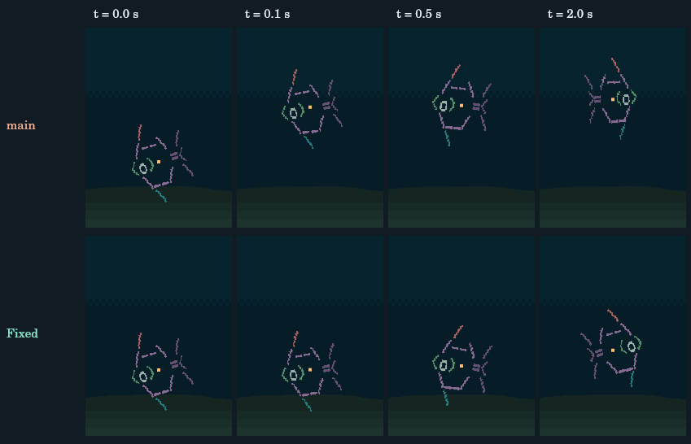

# Repository engineering audit — 2026-09-07

Baseline: `main` at `83246311defeeb231595926c81e440a182b18e68` (PR #27).
Work branch: `codex/repository-engineering-audit`. No production dependency was added.

## Scope and method

Reviewed the application entry points, simulation, persistent history and identity,
art and growth stages, pose/body/glyph rendering, damage tracking, browser storage,
all three development labs, tests, measurement/capture tools and deployment workflows.
Read recent Git history and PR discussion, particularly the successive feeding,
pitch and glyph-raster changes in PRs #22–27. Existing passing tests were treated
as evidence to check, rather than proof of the product's behavior.

The architecture remains a pure simulation tick, a scene composer, and a platform
adapter. Biological time drives history and growth; real time drives locomotion
and readable activities. Individuals retain their seeded personality, growth and
two-entry social memory. The audit preserves those distinctions and the bounded
population, effects and plant skeletons.

Investigation combined production tick replays, malformed-save generation, direct
pose/terrain measurements, actual Canvas pixel comparisons, behavior captures,
application event integration and CPU/damage measurements. Temporary trajectory
probes were replaced by reusable auditors. No diagnostic logging remains in `src/`.

## Findings and changes

P2 means a substantive behavior, identity, persistence or validation defect. P3
means a smaller visual, development or reporting defect. No critical security
finding is claimed.

| Finding | Severity | Root cause | Change and regression evidence |
| --- | --- | --- | --- |
| A malformed fish slot could discard the whole saved aquarium | P2 | Restore dereferenced null/non-record entries; storage caught the exception and returned a fresh aquarium | Validate each slot and repair locally, preserving healthy fish and tank history; malformed-slot tests and save fuzzing |
| Duplicate fish identities and fallback traits from another fish | P2 | Saved records were merged with the original fish at the same array index, without seed deduplication | Reserve valid identities before repairing slots; rebuild defaults from each fish's own seed; reordered/duplicate/arrival tests |
| Imported fields could poison rendering or clocks | P2 | Arbitrary saved properties were spread onto fish, admitting sprite overrides; enormous finite ages could overflow later calculations | Restore an explicit biological schema and bound imported clocks/coordinates/velocities; injected-art tests and first-frame render fuzzing |
| Invalid settings could allocate an enormous school or propagate invalid numbers | P2 | Creation, tuning and restore merged settings without a shared validation boundary | One settings sanitizer, with the ranges already exposed by the controls, runs before allocation and at every entry point |
| Plant species lookup accepted inherited object properties; old saves could duplicate plant identities | P2 | Plain-object lookups accepted names such as `constructor`; version-1 migration lacked deduplication | Prototype-free species table, own-property validation, explicit specimen errors, and repair of duplicate legacy seeds |
| Hidden tabs lost elapsed history; background autosaves concealed the lost time | P2 | Animation throttling discarded wall time, while autosaves stamped the frozen state with the current time | A visibility clock keeps the pause timestamp; resume applies bounded offline catch-up to both orientations and expires transient reactions/effects |
| Fish snapped away from feeding, and some initial fish snapped down from the surface | P2 | A grazing envelope changed immediately to a larger swimming clearance; creation used different bounds | Initialize with production clearance, then swim back when an envelope moves over a fish; protected mid-water clearance remains enforced |
| Peck displacement could accumulate in movement | P2 | Position already contained the last strike, but the next tick integrated from it and relied on a clamp to remove it | Track the applied transient dip separately from the swimming trajectory; interruption settles it instead of teleporting it away |
| Reversing a partially completed turn flipped the artwork early | P2 | Reversing progress did not exchange the turn's starting and ending facing | Reverse both endpoints and progress; tests cover both facings before and after the midpoint |
| Arrivals resized/recolored established fish and changed their grazing geometry | P2 | Depth strata depended on current population and array index | Keep the original six depth strata by seed; give arrivals independent seeded depths; render signatures remain stable across arrivals/reordering |
| Plant propagation moved existing bubble streams | P2 | Emitter host selection indexed the current plant array using its changing length | Resolve the original seeded host by identity; propagation/reordering tests cover both orientations |
| Exhaled bubbles followed moving/turning fish and used an approximate origin | P2 | Every frame reconstructed the bubble from the fish's current center, width and desired facing | Record one short-lived release at the shared posed mouth, then move it independently; release, growth/turn geometry, expiry and persistence tests |
| Silt followed the feeding fish; contact marks could appear without a recorded strike | P2 | Debris used the live mouth throughout its tail; bright marks only checked the newly rendered pose's schedule | Keep the last two strike origins and gate marks on the tick's event latch; also correct the mouth lead's double compression during turning |
| Native partial repaints differed from full repaints | P3 | Fractional water/terrain rectangles blended differently when clipped; the rounded software test canvas hid this | Integer background edges and shading selected from those actual bands; native Canvas oracle checks every pixel and every painted span |
| Controls displayed values different from restored/reset simulation settings | P3 | Control values were initialized independently and only some reset fields were synchronized | Synchronize inputs and outputs from the selected tank on startup, orientation change and reset; real entry-point integration test |
| Feeding measurements understated burial and overstated what they proved | P2 | Body fills were omitted in one tool, terrain was sampled under the center, and a tolerated gap was described as literal contact | Shared rendered-contact measurement includes glyphs and opaque spans against each painted terrain segment; expose the 0.25-row tolerance and fail the command on misses |
| Effect tests and captures could claim evidence without the necessary history | P2 | Several tests teleported activity age without recording contact; another required released silt to follow current facing | Replay production ticks, test cloud origins, verify font support after real strikes, and count pixels attributable specifically to the contact/silt effect |
| A “day 420” performance fixture was only day 365 | P3 | A single offline advance hit the intentional 365-day cap | Advance the fixture in bounded chunks and assert its actual age; both before/after measurements use this corrected tool |
| PR verification and architectural documentation were incomplete | P3 | Existing workflows tested `main` or an obsolete repair branch; README still described upright glyphs and nine body rectangles | Add PR verification, document current raster/pose contracts, label historical metrics, install test dependencies in existing workflows and stage only static site files for Pages |

## Important architectural changes

- Settings and original/max individual counts now have shared definitions.
- Effect origins use a shared rigid mouth anchor, including growth, depth, pitch,
  facing, physical panel aspect and turn compression. Small body flutter remains
  excluded from release origins; tests allow the existing bob's sub-row offset.
- `forageDip`, one exhalation record and two contact origins are transient and
  bounded. Save schema version 2 remains compatible; none becomes durable biology.
- Depth and emitter hosts are resolved by identity instead of population order.
- `src/dev/rendered-contact.js` is an independent panel-space oracle, not a copy
  of the simulation's clearance formula. It samples actual terrain rectangles.

## Before/after evidence

The simulation auditor uses eight fixed seeds, both orientations, 600 seconds per
tank at 0.1-second steps, with sparse touch interruptions. The same executable
also ran against the clean baseline worktree.

| Measurement | Baseline | Fixed |
| --- | ---: | ---: |
| Ordinary simulation ticks / individual samples | 96,000 / 576,000 | 96,000 / 576,000 |
| Unexplained vertical displacement failures (>0.25 row) | 104 | 0 |
| Largest observed natural feeding-exit step | 3.342 rows | 0.180 rows |
| Largest unexplained vertical step | 3.450 rows | 0.125 rows |
| Native redraw comparison, mature tanks | 14 / 1,080 frames differed | 0 / 1,080 |
| Native mismatch magnitude | Up to 10 pixels/frame, one color-channel unit | Exact equality |
| Ordinary default-watch pecks, landscape / portrait | 9 / 11 | 10 / 12 |
| Sampled production strike plunge, landscape / portrait | 16.5 / 12.5 px | 9.5 / 9.0 px |

The strike remains fast and readable; its smaller plunge removes accidental
accumulation. Counts are observations, not optimization targets. The baseline
has no explicit dip field, so the auditor excludes active substrate-search frames
from its unexplained-motion gate for that version. Exit comparisons remain valid.

The capture below starts both implementations from the **same real baseline
state**, immediately before frame 2612 of seed 83 in portrait (0.1-second ticks,
no injected touch). It isolates fish 3 and its effect while retaining the actual
background. Orange dots mark centers. The first step is **2.773 rows upward on
main versus 0.0146 rows upward after the fix**. No camera tracking is applied.

The corrected all-stage feeding sweep reports maximum painted underside burial
of **1.54 rows landscape / 1.86 portrait**. The old measurement reported 1.60 /
1.62, but omitted opaque spans and used the wrong terrain samples: those figures
are not a like-for-like performance comparison. Both orientations pass the
explicit 0.25-row strike-gap tolerance. The sampled production strikes have a
-0.25-row mouth gap, and 18 / 21 pixels attributable specifically to contact/silt
with luminance change greater than 6. Counting glyphs alone would not prove that.

## Behavioral and visual review

Captured all 15 scenarios in both orientations, plus native-size portrait bubble
and chase sequences and magnified feeding poses for the largest bodies. Inspected
the actual output, including the exit comparison above. The feeding sheet now
labels graze/strike/settling and removes unrelated objects from its anatomy view;
its overlay follows painted terrain instead of a different continuous curve.

Representative final landscape average/peak speeds (world units/second):

| Activity | Average / peak | Additional evidence |
| --- | ---: | --- |
| Playful chase | 0.66 / 1.03 | Pursuit, target evasion and separation/break remain present |
| Individual follow | 0.50 / 0.64 | Sustained trailing offset |
| Companion cruise | 0.10 / 0.32 | Close matched cruising |
| School follow | 0.27 / 0.51 | Join and adjustment to nearby school members |
| Bubble investigation | 0.48 / 0.87 | Upward pursuit, inspection, maximum 32-degree pitch |
| Open-water rest | 0.16 / 0.20 | Level low-energy drift |
| Plant shelter | 0.06 / 0.11 | Much quieter sheltering pose |

Plant investigation/weaving and surface ascent/probing retain separate phase
profiles. Their existing readability and screen-space checks pass. These are
engineering observations, not a blinded study of viewers' recognition.

## Performance and bounded cost

`measure-phase4.mjs` ran twice per revision, sequentially with reversed ordering
on the second pass. Each pass measures 3 seeds × 200 frames × 3 ages × 2
orientations after warm-up. It measures tick, scene composition and damage
calculation, **not native Canvas drawing or ESP32 execution**.

| Scenario | Baseline mean damage | Fixed mean damage | Baseline CPU range | Fixed CPU range |
| --- | ---: | ---: | ---: | ---: |
| Landscape, day 0 | 21.21% | 21.21% | 2.52–2.56 ms | 2.43–2.55 ms |
| Landscape, day 120 | 39.28% | 38.67% | 2.59–2.75 ms | 2.79–3.10 ms |
| Landscape, day 420 | 41.15% | 40.48% | 2.45–2.46 ms | 2.48–2.51 ms |
| Portrait, day 0 | 19.21% | 19.18% | 1.60 ms | 1.57–1.70 ms |
| Portrait, day 120 | 60.57% | 59.15% | 1.92–1.97 ms | 1.92–1.98 ms |
| Portrait, day 420 | 63.85% | 61.98% | 1.90–2.05 ms | 2.03–2.11 ms |

All cases had zero forced full redraws. Mature portrait can still damage about
96% of the screen in individual frames. The largest measured fish used 71 fill
spans, not the obsolete nine-span budget. Landscape day 120 costs somewhat more
after the fixes; this is recorded rather than presented as a speed improvement.
The absolute desktop cost did not justify a wider hot-path rewrite. No new
unbounded particle collection or persistent per-frame log was introduced.

## Validation and reproducibility

Environment: Node **24.19.0**, Linux, the repository's existing development Canvas
package installed with `npm ci`. CI is configured for Node 22. Commands below ran
successfully on the audit branch unless explicitly marked baseline.

| Command / scenario | Result |
| --- | --- |
| `npm test` on baseline | 276 passed |
| `npm test` after fixes | 300 passed |
| `npm run audit:simulation` | 96,000 ticks; 576,000 individual samples; zero failures |
| Same simulation with `--root=../Fish_view-baseline` | Reproduced 104 failures; nonzero exit as designed |
| `npm run audit:simulation -- --dt=0.25 --seconds=300 --timeScale=604800` | 19,200 ticks; 152,846 individual samples; zero failures; 2,100 biological days per tank |
| `npm run audit:simulation -- --dt=0.05 --seconds=120 --days=420 --tuning=extremes` | 38,400 ticks; 307,200 individual samples; zero failures at supported slider extremes |
| `npm run audit:persistence` | 1,000 deterministically mutated JSON saves; three tick/render frames each; zero failures |
| `npm run audit:render` | 1,080 mature frames; exact pixel equality; zero bounds escapes |
| `npm run audit:render -- --days=0 --frames=300` | 1,800 young frames; exact pixel equality; zero bounds escapes |
| `npm run measure:readability` | All forced activity gates and both ordinary 10-minute watches pass |
| `npm run measure:screen` | All panel-space gates pass, including effect-only visibility |
| `npm run measure:feeding` | All 32 unique growth-stage sprites in both orientations pass the stated gap tolerance |
| `npm run capture:behaviors` | Both contact sheets and manifest generated; visual review completed |
| `node tools/measure-phase4.mjs [worktree]` | Two comparative passes per revision; results above |
| `node tools/measure-plants.mjs` | 2,000 measured frames; zero full redraws; landscape 431–491, portrait 528–556 plant glyphs |
| `node tools/inspect-plant-lab.mjs` | Representative skeletal/plant lab views complete |
| `git diff --check` and production logging scan | Clean |

The 24 added tests cover save recovery/identity/settings/species, startup and
feeding-exit continuity, turn reversal, stable depth/emitters, mouth geometry,
independent exhalation/silt, recorded contact, rendered terrain/body measurement,
visibility clocks and the actual application entry point. Five existing tests
were corrected: exhalation history, integer surface placement, feeding contrast,
strike glyph support and silt-origin behavior. None was deleted.

Existing multi-month simulations, deep-peck tuning tests, growth-stage geometry,
plant continuity, pitch rasterization, relationships, history/migration and damage
tests also pass. New audit JSON and failure PNGs go to ignored `.audit-output/`;
bulk captures remain ignored. Only the selected exit evidence image is committed.

## Preserved behavior and remaining limits

- Kept the authored fish artwork, body profiles, growth ladders, pitch ceiling,
  clustered feeding rhythm and distinct activity/phase controllers. Some large
  adult fin/body ink still overlaps the substrate; the corrected measurements
  expose that authored tradeoff instead of concealing it with a center sample.
- Kept the chronological bounded history resolver, plant propagation caps and
  accelerated-drive cap. Existing timeline/long-run evidence supports them.
- Kept silt behind the fish's body and cleared it when its feeding bout ends.
  The production visibility check confirms a visible cue in its sampled strikes;
  this is not proof that every possible occluded pose exposes the whole cloud.
- Clearance remains a conservative authored model with measured tolerances.
  The shared rigid mouth anchor excludes subtle flutter and bob, and a
  0.25-row contact tolerance is not a claim of exact per-pixel contact everywhere.
- Native Canvas is a stronger oracle than the old rounded mock, but no physical
  ESP32 display, browser-specific GPU backend, mobile suspension policy, backlight
  or power budget was tested. Application lifecycle wiring was tested with a
  controlled event host and real Canvas, not a full browser automation session.
- Seed/tuning sweeps are broad, deterministic samples, not an exhaustive proof
  over all seeds or possible future artwork/tuning changes. Their failure reports
  and regression tests make further investigation reproducible.
