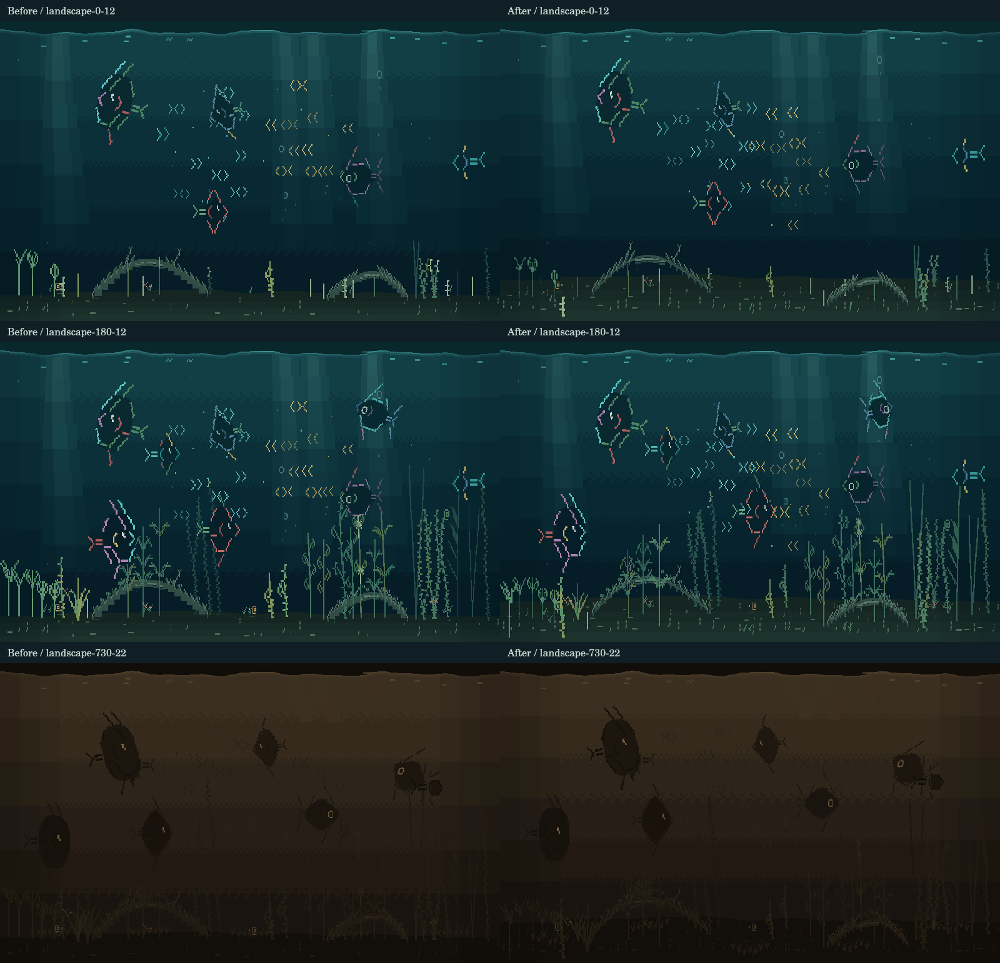
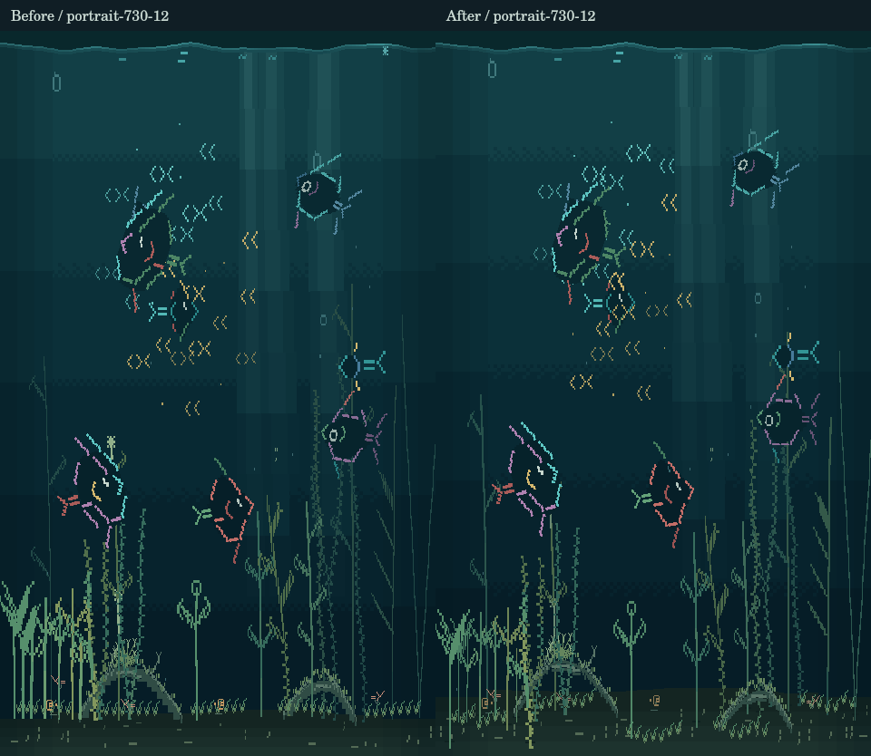
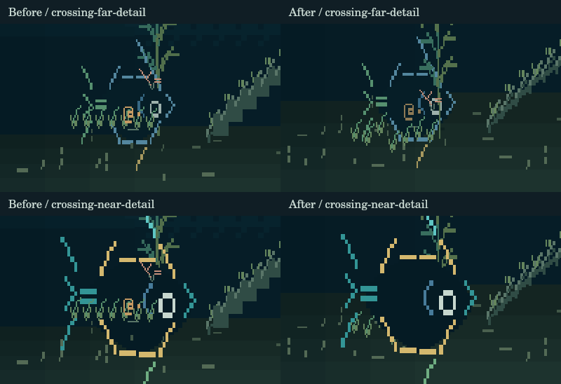

# A floor with depth

The previous scene rooted every plant on the rear sand silhouette. Plant species selected a fixed render layer, all named fish stayed between two plant groups, and PR #29 placed all snails and shrimp in front of every fish. These rules contradicted the apparent depth conveyed by size and position.

Each plant now has a stable, seed-derived distance. Species still guide the planting composition, but specimens of the same species occupy different positions across the floor. That distance controls root position, skeleton scale, glyph thickness, atmospheric color, and sorting. The floor expands from two to three logical rows: 15% of the landscape panel. Sparse root shadows reinforce contact with the sand.

Fish, schooling fish, plants, bubbles, wood, small residents, and drifting tufts now interleave on the same distance axis. Snails and shrimp have stable routes across their own part of the ground. Meadow colonies vary in depth as well as horizontal position. Epiphytes keep the distance of their supporting wood. Thin raster strokes replace the driftwood's filled diagonal bounding boxes.

Feeding uses the ground projected beneath each fish's distance. Mouth contact, released silt, the renderer, and the contact measurement tools share that location. Ordinary swimming keeps conservative clearance above the rear edge. Existing saves derive the new arrangement from their original seeds; no save fields or population increases are needed.

## Visual evidence

These are production simulation and native bitmap-renderer captures. Normal scenes use seed 83 after 35 seconds of unforced simulation. Because the floor changes swimming bounds, the two versions' fish trajectories differ. Day zero, day 180, and the warm nightlight at day 730 appear below.





The following fixtures deliberately hold an adult across a snail and plant to inspect occlusion. They are positioning fixtures, not demonstrations of natural feeding. The upper row is a far fish; the lower row is a near fish. Each row shows before on the left, after on the right. In the new near view the fish hides the snail; in the far view the snail remains visible in front.



## Validation and cost

- 309 tests pass, including four new focused depth tests. Existing tests that required every plant to share a root line or every snail to paint above every fish were replaced with spatial assertions.
- Native audit: 540 incremental frames match full redraws exactly across three seeds, both orientations, touch, and a day/night transition. No escaped spans.
- This audit exposed another renderer defect: dither blocks extend beyond their nominal transition interval. Damage culling now includes the final block's overhang, preventing small stale strips.
- Feeding stage sweep and screen-legibility checks pass. Contact-sheet contours now use the projected floor rather than the rear silhouette.
- The full test suite includes long-running growth and feeding checks. No additional persistence fuzzing was needed for this visual change.

The same 150 sampled frames per age/orientation (seeds 5, 83, 147; 40-frame warm-up; 50 measured frames per seed) give:

| Scene | Average repaint before → after | Average glyphs before → after | Peak repaint before → after |
|---|---:|---:|---:|
| Landscape, new | 21.9% → 21.8% | 408 → 441 | 31.0% → 35.4% |
| Landscape, 730 days | 44.3% → 40.6% | 1,093 → 1,078 | 75.8% → 77.8% |
| Portrait, new | 20.2% → 20.2% | 410 → 427 | 31.0% → 45.0% |
| Portrait, 730 days | 61.2% → 55.9% | 1,202 → 1,137 | 95.1% → 98.8% |

There were no full redraws in either sample. Root shadows add one static rectangle/object per plant; they do not animate. Plant colors use five bounded depth tables rather than per-glyph continuous color mixing. The new distance key lives in the existing layer/signature field, so changes in overlap order invalidate the relevant objects even when their screen coordinates stay still. No framebuffer-sized depth buffer, shader, new runtime dependency, or unbounded geometry is introduced.

These are desktop prototype measurements, not ESP32-S3 frame-rate or 24/7 hardware validation. Portrait still has expensive peak frames; the mature-scene guard records the measured 98.8% peak while retaining the no-full-redraw requirement.

Raw reports: [before budget](assets/habitat-depth/budget-before.json), [after budget](assets/habitat-depth/budget-after.json), [native audit](assets/habitat-depth/render-audit.json).

## Reproduce

```sh
npm ci
npm test
npm run audit:render -- --frames=90 --seeds=5,83,147
npm run measure:feeding
npm run measure:screen
npm run measure:living -- --frames=50

# Optional baseline checkout for the paired visual evidence:
git worktree add --detach /tmp/fish-depth-before 86f8ef2
npm run capture:depth -- --root=/tmp/fish-depth-before --output=/tmp/depth-before
npm run capture:depth -- --compare=/tmp/depth-before
```

The capture tool also saves each native-resolution image independently, including young/mature day scenes and night scenes in both orientations.
