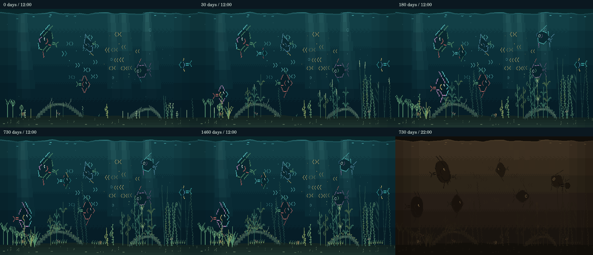

> Subsystem report from before the horizontal-only migration. Historical measurements below are retained as evidence; portrait is retired. Current tools capture and measure only the 800 × 480 aquarium. See [current architecture](../README.md).

# A habitat worth watching

The original aquarium had a substantial fish activity vocabulary, but most of
its visible world was fish crossing open water above thin plants. This upgrade
adds a landscape, smaller residents, reasons to investigate the water, and
changes that continue after the initial fish and plant growth.

[Watch thirty seconds of the production aquarium](assets/living-aquarium/living-aquarium.mp4).
This is native 800 × 480 output from the real simulation and incremental renderer,
using seed 83 at 180 days, with no forced activity or touch.

## What to notice

- Two gold and teal shoals follow slowly moving gathering places. The existing
  separation, alignment, cohesion and boundary forces still steer each fish.
  The groups separate and gather again instead of repeatedly crossing a fixed
  middle band. Nothing assigns their positions to a formation.
- Snails creep over the real terrain contour. Shrimp travel along the bottom,
  making short swimming hops between longer stretches of walking. These are
  seeded ambient residents, with reconstructed paths rather than individual
  drives, collisions or saved memories.
- Two drifting seed tufts fall through open water. Curious fish can approach,
  slow down and inspect them, then move on. Selection checks actual proximity,
  visibility and the fish's safe swimming zone. Each tuft's cycle has its own
  identity so recycling it cannot drag a fish to the opposite end of the tank.
- A close encounter with a compatible fish can permit a first playful chase
  before a friendship is established. Resting and foraging companions are
  excluded. The existing energy, daytime and personality requirements remain.
- Two irregular driftwood arches provide darker mass and low shelter shapes
  behind the fish. Moss gradually covers them. Small rosettes spread sideways
  across the sand; fern-like epiphytes later unfurl from the larger log.
- Sparse suspended dust adds depth. Night uses the existing warm palette and
  retains the illuminated water field and dark fish silhouettes.

## Timescales

| Time since setup | New visible development |
| --- | --- |
| First session | Wood, one snail, one shrimp, tufts and traveling shoals |
| One week | A second shrimp |
| Six weeks | A second snail |
| Three months | A third shrimp; developing moss and meadow |
| Seven months | Moss approaches its mature coverage |
| Eight months onward | Epiphyte fans begin unfurling from old wood |
| Eighteen months | The low meadow reaches its bounded spread |
| Four years | Wood-associated moss finishes its slow color shift |
| Almost five years | Epiphyte fronds reach their full length |
| Every year | A seeded seasonal window accents meadow and epiphyte tips |

These additions derive from aquarium age and seed. Existing saves gain the
appropriate mature habitat automatically. Offline time gives the same habitat
as live aging, and there are no new save fields, population penalties, chores,
notifications, or growing event logs. Visible locomotion uses real elapsed time,
so accelerated biology does not accelerate the animals across the screen.
Resident paths restart with the visual animation clock on reload, like other
ambient effects; they do not preserve their exact last position.

## Evidence and cost

`npm run capture:living` generates the canonical aquarium at six age/time combinations,
plus an unforced three-minute observation report. Add `-- --video` to encode a
thirty-second MP4 with FFmpeg. The ordinary capture needs only the existing
Canvas development dependency. The behavior lab also has a **Drifting seed
inspection** scenario, including its steering controls.

In seed 83's unforced three-minute observations, both orientations selected the
new inspection activity and reached the close inspection phase. The checked-in
[observation report](assets/living-aquarium/observation.json) includes activity
samples, encounter entries and school center positions. Activity counts are
sampled fish-frames, not independent encounters.

Five new tests cover reachable natural encounters, school travel and movement
continuity, resident continuity, disappearing targets, derived habitat across
save/offline time, and bounded content from day one to twenty years. The full
suite passes 305 tests. The existing simulation audit passed 96,000 ticks with
zero invariant failures. The native Canvas audit compared 1,080 incremental
frames with full redraws with zero differences or escaped spans. Feeding still
meets the existing 0.25-row strike-gap gate; the existing bounded persistence
check passed 200 cases.

The native pixel check caught fractional new wood fills blending differently
when clipped; those spans now use integer device coordinates. Existing size
checks still apply to fish and plants; only the authored small life/ground cover
objects use the smaller glyph range.

`npm run measure:living` measures seeds 5, 83 and 147 at day zero and two years
in both orientations. It can use `-- --root=/path/to/baseline` to compare the same
workload. The following sample uses 120 measured frames per seed after 40 warmup
frames, with the pre-upgrade commit `2098724` as the baseline:

| Orientation / age | Mean repaint before | Mean repaint after | Mean glyphs before → after |
| --- | ---: | ---: | ---: |
| Landscape / new | 21.1% | 22.1% | 297 → 408 |
| Landscape / two years | 40.2% | 43.3% | 829 → 1,092 |
| Portrait / new | 19.3% | 20.2% | 298 → 409 |
| Portrait / two years | 60.6% | 60.4% | 944 → 1,208 |

No full redraws occurred in those measured sequences. Additional habitat work
is capped at seven resident/drifting records, ten dust particles, thirty-five
rosettes, thirty-eight wood segments and eight six-glyph fronds. The sampled
complete habitat stays below 270 extra glyphs and 100 scene objects. The existing
school and persistent-fish caps are unchanged. All drawing uses bitmap glyphs
and small fills through the existing damage compositor.

This repository remains the JavaScript prototype. Desktop timings are not an
ESP32-S3 benchmark, and portrait can still repaint most of the panel on some
frames. Physical panel brightness, flash endurance, memory usage and sustained
firmware frame rate require measurement on the actual device; this change does
not implement or deploy that firmware.
