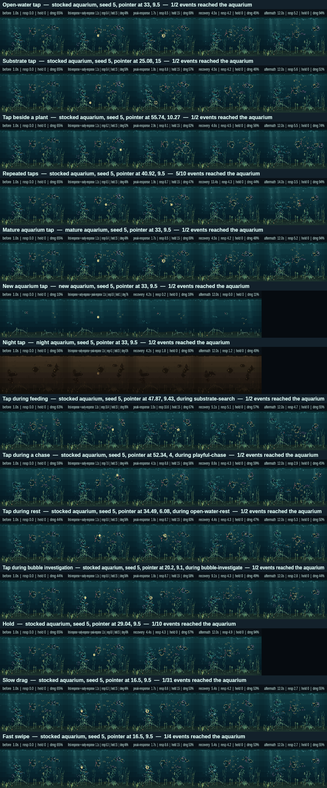

# Phase 0 — Interaction observation and baseline instrumentation

**Branch:** `claude/phase-0-completion-2srbne`  ·  **Baseline commit:** `b86ba21`  ·  **Date:** `2026-09-09`

Stage 2 is about to replace how the aquarium notices the person outside the
glass, and the only way to tell whether a replacement is better is to be able to
run the same gesture against the same aquarium before and after and read the
difference. This phase builds that instrument: deterministic pointer histories,
a controlled replay that measures the touched aquarium against the same evening
left alone, per-fish and whole-aquarium measurements, semantic captures, and
fourteen recorded scenarios covering the nine baseline situations the plan
requires plus the gestures and contexts later phases need.

Nothing a viewer can see changed. What changed is that the collapse the baseline
document describes in prose is now a reproducible measurement with a per-fish
table under it: **in all 42 observations — every scenario, every seed, every
context — one press put the entire cast into `touch-react` within one frame,
at 0.1 s latency, at every distance from 1.6 to 43.4 cells.**

## Changes made

**Production:** none. `src/sim`, `src/render`, `src/platform` and `src/app.js`
are untouched; `git diff --stat` for this phase shows only tooling, tests and
documentation.

**Tooling:**

- `src/dev/interaction-observation.js` — the harness. Gesture builders (`tap`,
  `hold`, `drag`, `swipe`, `repeatedTaps`), a bounded pointer-history type with
  a text encoding, the single production-path seam `applyPointerEvent`, the
  controlled replay `observeInteraction`, semantic-moment detection, the
  aquarium contexts, and the fourteen `INTERACTION_SCENARIOS`.
- `tools/observe-interaction.mjs` — `npm run observe:interaction`. Runs the
  scenario sweep across seeds, prints the whole-aquarium table and one
  scenario's per-fish table, replays an arbitrary encoded history with
  `--history=`, writes the full record (including frame timelines) to
  `.audit-output/interaction-observation.json` and a committable summary with
  `--evidence=`.
- `tools/capture-interaction.mjs` — `npm run capture:interaction`. Contact
  sheets at the six semantic moments, and native-resolution GIF capture with
  `--scale=1 --gif`.
- `tests/interaction-observation.test.js` — eight tests about the instrument.
- `package.json`, `AGENTS.md` — the two new commands and the harness's place in
  the architecture map.

## Architecture

**A pointer history is data.** `{ seconds, type, x, y }` in world cells, sorted,
validated, and capped at `POINTER_HISTORY_LIMIT = 64` events — a five-second
drag sampled at the frame rate with room to spare. `encodePointerHistory` gives
one line of text per gesture (`1:d:33:9.5 1.1:u:33:9.5`), which the tool can
replay months later with `--history=`. Nothing in the harness samples a clock or
an unseeded random number; the replay is as deterministic as the simulation it
drives.

**Every observation is a controlled experiment.** The same settled aquarium is
advanced twice — once with the pointer history, once untouched — frame for
frame. Fish drift, plants sway, snails crawl and bubbles rise in both, so only
the difference between the two futures is attributed to the interaction. Without
the control run, an evening's ordinary motion reads as a response; with it, the
harness can say that the snails and shrimp did not react at all (0 in all 42
observations), which is a finding rather than an absence of measurement.

**The interaction path has exactly one seam.** `applyPointerEvent` is the only
place that turns a pointer event into aquarium state, and today it does what
`src/app.js` does: map the event through `aquariumPoint`, ignore the developer
hotspot, and call `applyTouch` on a press. Movement, hold duration and release
are delivered and recorded as inert. Phase 1 replaces the body of that one
function; the scenarios, the measurements and the captures survive the change,
which is the entire reason this phase comes first.

**Response is measured relative to the stimulus, not by drift.** Two simulations
that diverge once keep diverging, so raw separation between the two runs grows
all evening and would always peak on the last frame. The response curve is the
difference in *closing speed* on the stimulus between each fish and its
untouched twin: it spikes when the aquarium answers and decays when it stops,
which is what makes "peak" and "recovery" mean something.

**Bounds.** The pointer history is capped at 64 events. The per-observation
record is one entry per persistent fish (15) plus one row per frame; nothing
here runs on the device, but the cap exists so a "history" cannot quietly become
an unbounded log. Plants, bubbles and residents are compared every fifth frame —
their responses last seconds, not frames.

## Visual result

Nothing is visibly different in the aquarium; this phase changed no production
behaviour. What is newly visible is in the contact sheet: the same nine
situations the plan asks for, each shown at the frame before the press, the
frame the aquarium first answers, the peak, the moment it lets go, and the
aftermath twelve seconds later.

Read the rows against each other and the baseline's central problem is a
picture: fifteen fish that were spread across eight activities all converge on
the tap and hold the same posture for three seconds, whether they were feeding
on the sand two cells away or following a bubble thirty cells away, at noon or
at two in the morning. The slow-drag row is labelled `1/31 events reached the
aquarium`; the hold row, `1/10`. Everything after the press is inert.

## Evidence

| Claim | How it was checked | Where the evidence is |
| --- | --- | --- |
| Deterministic pointer histories can be replayed | The same history observed twice compares equal on fish, aquarium, renderer and moments; a history round-trips through its text encoding | `tests/interaction-observation.test.js` |
| The replay is the production interaction path | `applyPointerEvent` on a press deep-equals `applyTouch`; move, up and hotspot presses return the same state object | `tests/interaction-observation.test.js` |
| Before / event / response / recovery can be observed | Six semantic moments found from the response curve, ordered and inside the observation, for all 42 observations | [`interaction-observation.json`](../assets/stage-2/phase-0/interaction-observation.json), contact sheet |
| Per-fish measurements the plan lists | Identity, traits, glass affinity, familiarity, start and post-input activity, latency, start and closest distance, travel, average and peak speed, peak acceleration, peak pitch, turn magnitude and count, time near the stimulus, ending activity, outcome | `npm run observe:interaction -- --detail=<id>`; `fishColumns` in the evidence file |
| Whole-aquarium measurements the plan lists | Strong / weak / unaffected responders, school centroid displacement and spread change, plants disturbed, bubbles created and disturbed, residents affected, scene objects, glyphs, rectangles, damage percent, full-redraw flag | evidence file, `aquarium` and `render` blocks |
| Renderer damage is recorded | Per-frame dirty rectangles and damaged-pixel percentage for every observation, next to the untouched control | table below |
| Native captures can be generated | `npm run capture:interaction -- --scenario=open-water-tap --scale=1 --gif` produced a 800 × 480, 120-frame GIF (5.2 MB, not committed — the still frames make the point) | `.behavior-captures/` |
| Current touch behaviour has baseline evidence | 14 scenarios × 3 seeds, including the nine the plan names | evidence file, contact sheet |
| Validated on the production path, not a fixture | The feeding, chase, rest and bubble scenarios advance an ordinary aquarium until a fish *chooses* that activity, then tap beside it; the precondition and the time it took are recorded per scenario | `precondition` in the evidence file |
| No production interaction semantics changed | No file under `src/sim`, `src/render`, `src/platform` or `src/app.js` was modified; the gate is green and reads the same as the baseline: 331 tests (323 before, 8 added here), simulation 48 000 ticks / 0 failures, persistence 200 malformed saves / 0 failures, render 540 frames / 0 differing frames / 0 escaped spans, feeding 0 stages outside tolerance | `npm run verify`, ~3 min 25 s |

The readings that matter most, from the sweep (`npm run observe:interaction`):

| Reading | Result |
| --- | --- |
| Observations | 42 (14 scenarios × seeds 5, 147, 1234) |
| Distinct activities one frame after the press | **1, in all 42** — 6–9 before it |
| Fish put into `touch-react` | every persistent fish, in every observation |
| Response latency | 0.1 s (one frame) for all 196 measured fish, at start distances of 1.6–43.4 cells |
| Outcome after twelve seconds | 96 resumed the activity they were interrupted from, 100 ended somewhere else |
| Pointer events that reached the aquarium | tap 1/2, repeated taps 5/10, hold 1/10, slow drag 1/31, fast swipe 1/4 |
| Peak response | 1.1–11.5 s after the press; recovery 4.2–13.4 s |
| Small residents affected | 0, everywhere |
| Substrate presses that released bubbles | 3–5 bubbles; open-water presses, 0 |

Two things worth knowing before Phase 1 uses this harness:

- **A mature aquarium is not a heavier case than a stocked one.** The ten-year
  context measures within noise of the 396-day one on the same seed — the
  roster, the plants and the save all saturate long before then. Phase 10 should
  stress the renderer with something other than age.
- **Night is the one context where the response is visibly weaker.** At 02:00,
  6–10 of the fifteen respond strongly against 12–15 by day, because night
  slows locomotion rather than because anything decides to answer differently.

## Performance

The harness measures the untouched aquarium with the same instrument that
measures the touched one, which is the honest comparison. Untouched figures are
a 30-second control on each seed; interaction figures are the twelve-second
windows of the stocked and mature scenarios.

| Measure | Baseline (2026-09-09) | This phase |
| --- | --- | --- |
| Mature untouched avg / max damage | 54.0 % / 98.1 % | 51.0–58.0 % / 95.2–98.1 % |
| Interaction avg / max damage | 54.8 % / 95.6 % | 53.0 % / 97.9 % |
| Dirty rectangles per frame | 15.6–20.0 | 9.9–23.1 |
| Full redraws | 0 | **0**, in all 42 observations |
| Scene objects / glyphs | 245–252 / 1 102–1 172 | 243–256 / 1 102–1 195 |

No production code ran differently, so these are the same numbers read by a new
instrument; that they land on the baseline's is the check that the instrument is
sound. The spread is wider because the sweep covers more seeds, contexts and tap
positions than the baseline's single reading, and a tap near a plant repaints
more than one in open water.

Tooling cost, for anyone about to run it: the full sweep is about 47 s, the
full contact sheet about 60 s, the test file 3.7 s.

## Persistence

Unchanged. `PERSISTENCE_VERSION` is still 2, no field was added, and the harness
never serialises. The pointer history is a developer artefact that lives in a
tool run and an evidence file, never in the save — the invariant test that
forbids `reaction`, `stimuli`, `impulses`, `pointer` and `gestures` in the
payload still passes untouched.

## Remaining limitations

- **Hold, drag and swipe are measured, not answered.** The harness delivers
  every event; today only the opening press means anything. Phase 3 and Phase 4
  are what make those rows change.
- **The stimulus point is the first press.** For a drag, distances and closing
  speeds are measured against where the finger went down, not where it is now.
  Phase 4 should extend the response metric to a moving stimulus when a drag
  actually carries meaning.
- **Response latency cannot currently distinguish attention from arithmetic.**
  Every fish deviates in the first frame because `applyTouch` writes every
  fish's velocity, so 0.1 s is a floor rather than a measurement. It becomes a
  real reading in Phase 2, when a fish can decide not to answer.
- **Plants are compared by posed tip position** at a 0.5 s cadence, which counts
  a plant as disturbed without saying how much. If Phase 5 needs disturbance
  magnitude, that is a small extension.
- **No long-watch or habituation measurement.** Observations are seconds long by
  design. Phase 9 needs a different instrument, built on the same replay.

## Gate decision

| Gate item (plan §6) | Met |
| --- | --- |
| Deterministic interaction histories can be replayed | Yes — bounded, encodable, replayable; equality proved by test and by `--history=` |
| Before / event / response / recovery can be observed | Yes — six semantic moments per observation, found in the data rather than at fixed percentages |
| Renderer damage is recorded | Yes — per-frame rectangles, damaged-pixel percentage and full-redraw flag, against an untouched control |
| Native captures can be generated | Yes — contact sheets at any scale, 800 × 480 GIF at `--scale=1` |
| Current touch behaviour has baseline evidence | Yes — the nine required scenarios plus hold, drag, swipe, a new aquarium and a night aquarium, across three seeds |
| No production interaction semantics have changed | Yes — no production file modified; `npm run verify` green |
| Harness supports tap, hold, slow drag, fast swipe, repeated taps, multiple contexts | Yes — five gesture builders; new, stocked, mature and night aquariums; any seed |
| Runs against new, stocked and multiple deterministic seeds | Yes — `--seeds=`, four contexts |

**PASS — phase complete; proceed.**
