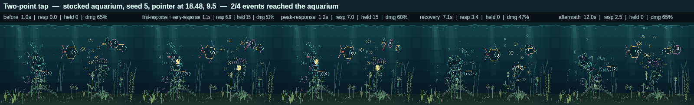

# Phase 1 — Stimulus and impulse architecture

**Branch:** `claude/phase-0-completion-2srbne`  ·  **Baseline commit:** `ad195fd`  ·  **Date:** `2026-09-09`

The aquarium had one interaction concept: `state.reaction`, a point with an age
and a duration. Everything read it directly — the school steered at it, all
fifteen fish were forced into `touch-react` by it, plants bent away from it, the
sand released bubbles under it, the renderer drew a ripple on it. One tap, one
object, one meaning, and no way for anything to be noticed without also being
shoved.

This phase replaces it with two bounded transient event types — **stimuli**
(things inhabitants can notice) and **impulses** (water actually moving) — and
routes the existing tap through them. A viewer sees the same aquarium: the same
tap, the same fifteen fish, the same ripple, to the pixel. What changed is that
the aquarium can now hold more than one disturbance at a time, and that
perceiving something and being pushed by it are no longer the same event.

## Changes made

**Production:**

- `src/sim/interaction-events.js` — new. The model: `createStimulus`,
  `createImpulse`, `registerTouch`, `ageInteractionEvents`, `dominantStimulus`,
  `perceivesStimulus`, `stimulusSalience`, `impulseStrength`, and the caps.
- `src/sim/state.js` — `applyTouch` registers one stimulus and one impulse and
  then applies the same immediate response it always did. `createAquariumState`
  starts with empty lists; `advanceOffline` clears them. `state.reaction` is
  gone.
- `src/sim/tick.js` — ages events and drops the spent ones; the school steers at
  the most salient stimulus.
- `src/sim/fish-activities.js` — a fish answers a stimulus it can perceive
  rather than a global reaction; the touch-react target follows the stimulus.
- `src/sim/plants.js` — the bend is an impulse effect, summed over live impulses
  and using the event's own radius and envelope rather than a hard-coded 7.5
  cells.
- `src/sim/bubbles.js` — a substrate burst belongs to an impulse that reached
  the sand (`contact === "substrate"`), one burst per impulse.
- `src/render/render.js` — one ripple scene object per live impulse; the plant
  lab's touch preview poses an impulse.
- `src/dev/behavior-showcase.js` — the touch-react showcase poses a stimulus and
  an impulse.

**Tooling:**

- `tools/observe-interaction.mjs` — `--compare=<evidence.json>` diffs this run
  against an earlier phase's evidence, scenario by scenario. That is how a phase
  now says whether it changed what a viewer sees or only how the aquarium is
  built.
- `src/dev/interaction-observation.js` — one new scenario, `two-point-tap`: two
  presses in the same frame, half a tank apart. It exists because the old model
  could not represent it.

**Tests:** `tests/interaction-events.test.js` (nine), plus the fixtures in seven
existing test files updated from `reaction` to the event model, and
`tests/stage-2-invariants.test.js` extended to forbid persisting
`interactionSequence`.

## Architecture

**Two types, and the distinction is the point.**

| | Stimulus | Impulse |
| --- | --- | --- |
| Means | something can be noticed | water is moving |
| Fields | `id`, `source`, `x`, `y`, `intensity`, `radius`, `ageSeconds`, `durationSeconds`, `sequence` | `id`, `source`, `x`, `y`, `strength`, `radius`, `ageSeconds`, `durationSeconds`, `contact`, `seed`, `sequence` |
| Read by | fish activity selection, school steering | plants, substrate bubbles, the ripple |
| Needs | a nervous system | nothing |

A tap creates one of each, which is why they look redundant today. They stop
looking redundant in Phase 2, where a fish decides what a stimulus is worth, and
in Phase 5, where a fish's own body makes an impulse nobody is watching.

Every field is used now, and the two that look like constants are the ones later
phases turn up: a tap's stimulus `radius` currently spans the aquarium — which
is exactly why one tap still reaches all fifteen fish, and exactly what Phase 2
narrows — and `intensity`/`strength` are 1 because a tap is the only gesture
that exists. `contact` is `"substrate"` or `"water"`; Phase 5 gives `"surface"`
the same kind of meaning.

**Bounds, and where they are enforced.** All in `src/sim/interaction-events.js`:

| Bound | Value | Why it holds |
| --- | --- | --- |
| Live stimuli | `MAX_STIMULI = 6` | `registerTouch` evicts the faintest when full |
| Live impulses | `MAX_IMPULSES = 6` | same |
| Event life | 3.2 s | `ageInteractionEvents` drops an event the frame it is spent; it is the only thing that removes one, and it runs every tick |
| Near-repeats | 1.2 cells | a press that close refreshes the live event instead of taking a slot, so drumming on the glass cannot fill the cap |
| Identity | 16-bit wrapping counter | ids repeat only after 65 536 interactions, by which time every event carrying an earlier one is hours gone |
| Touch bubbles | ≤ 6 per impulse | one burst per substrate impulse; measured worst case below |

Fifty rapid taps across the tank leave six stimuli and six impulses. Nothing
here is persisted, and nothing accumulates across a session.

**Determinism.** No clock and no random number. Event identity comes from the
state's own counter; the bubble burst's variation comes from the aquarium seed
and the press position, so touching the same place twice raises the same
bubbles; and the one genuine tie — two fingers landing in the same frame, equal
salience — is broken by sequence number, which is state, not chance.

## Visual result

Nothing, for every gesture the product had before this phase. The Phase 0
contact sheet — fourteen scenarios, five semantic moments each, seventy rendered
aquarium frames — regenerates **byte-identical** after the replacement
(`md5 8cfbd99d…`). That is the result this phase wanted: an architectural change
a viewer cannot see.

One thing is newly possible, and it is visible. Two presses at once used to mean
one ripple, because the second reaction replaced the first. Now both
disturbances live:

Two rings, two bends in the plants near them, one aquarium. The fish still all
answer the same press — ending that is Phase 2's job, not this phase's.

## Evidence

| Claim | How it was checked | Where the evidence is |
| --- | --- | --- |
| The tap is routed through the new infrastructure | `state.reaction` no longer exists anywhere in `src/`; `applyTouch` registers events and every consumer reads them | `git diff`, `tests/interaction-events.test.js` |
| Perception and disturbance are genuinely separate | A stimulus with no impulse moves a fish and leaves plants still; an impulse with no stimulus bends plants and leaves fish alone | `tests/interaction-events.test.js` |
| The harness produces equivalent baseline results | 15 scenarios × 3 seeds, compared field for field against the Phase 0 evidence: **42 identical, 0 changed, 3 new** (the two-point scenario the baseline had no equivalent of) | `npm run observe:interaction -- --compare=docs/assets/stage-2/phase-0/interaction-observation.json` |
| Existing visual behaviour has not regressed | The Phase 0 contact sheet regenerates byte-identical; the independent pre-Stage-2 instrument reports the same numbers it did before Stage 2 began | `npm run capture:interaction`, `npm run measure:stage2-baseline` |
| The simulation remains deterministic | Same aquarium plus same event history gives a deep-equal aquarium; the audits replay unchanged | `tests/interaction-events.test.js`, `npm run audit:simulation` (48 000 ticks, 0 failures) |
| Transient events are bounded | Cap, coalescing, immediate expiry and identity wrap all tested; 50 rapid taps leave 6 and 6 | `tests/interaction-events.test.js` |
| Persistence remains bounded | Save schema untouched, transient state absent from the payload even when a forged save carries it, restore and offline start quiet | `tests/interaction-events.test.js`, `tests/stage-2-invariants.test.js`, `npm run audit:persistence` (200 malformed saves, 0 failures) |
| The gate is green | 340 tests (331 before, 9 added), simulation 48 000 ticks / 0 failures, persistence 200 / 0, render 540 frames / 0 differing / 0 escaped, feeding 0 stages outside tolerance | `npm run verify`, 3 min 19 s |

The one intentional difference, measured by replaying the identical pointer
history against the old code and the new (`--root=` at commit `ad195fd`, two
presses in the same frame, half a tank apart):

| | Old (single reaction) | New (events) |
| --- | ---: | ---: |
| Plants disturbed | 9 | 10 |
| Peak scene glyphs | 1 194 | 1 212 |
| Average damage | 52.20 % | 52.24 % |
| Rectangles per frame | 18.22 | 18.20 |
| Fish responding strongly | 15 | 15 |
| Semantic moments | 1.0 / 1.1 / 1.1 / 1.2 / 7.1 / 12.0 s | identical |

A second ripple costs seventeen glyphs and four hundredths of a percent of the
panel. The fish response is unchanged to the frame.

## Performance

Fourteen of the fifteen scenarios are identical to the Phase 0 readings, so the
table below is the phase's real cost: the two-point scenario, and the worst case
the caps allow.

| Measure | Baseline (2026-09-09) | This phase |
| --- | --- | --- |
| Mature untouched avg / max damage | 54.0 % / 98.1 % | unchanged (51.8–58.3 % / 95.4–98.1 %, same instrument, same numbers) |
| Interaction avg / max damage | 54.8 % / 95.6 % | unchanged for every pre-existing scenario |
| Two simultaneous presses | not representable | 52.2 % avg / 68.1 % worst, 18.2 rectangles |
| Six simultaneous substrate presses (the cap) | not representable | 277 scene objects against 244 quiet, 22 concurrent touch bubbles, worst frame 98.1 % — no higher than an ordinary mature frame |
| Full redraws | 0 | 0, everywhere |
| Scene objects / glyphs | 245–252 / 1 102–1 172 | unchanged; +17 glyphs per additional live impulse |

The worst case is what the caps buy: six impulses is the most the aquarium will
ever hold, and even then the frame is no more expensive than an untouched mature
evening already is.

## Persistence

Unchanged. `PERSISTENCE_VERSION` is still 2, the payload has the same fields,
and a stocked ten-year aquarium with fifty taps still serialises to 17 853 bytes
— the same byte count as before the phase. Transient events are not persisted;
a restore and an offline gap both start with empty lists, and a save that has
been tampered with to carry `stimuli` or `impulses` cannot smuggle them back in.
The invariants test now also forbids `interactionSequence`.

## Remaining limitations

- **Every fish still answers every tap.** The stimulus radius spans the
  aquarium and `tickFishActivity` still forces `touch-react` on anything that
  perceives it. That is Phase 2, and it is now a change in one condition.
- **Direction, motion velocity and recent path are not modelled.** A stimulus
  knows where it is, not where it is going. Phase 4 adds them, with the path
  bounded to a fixed sample count, when a drag first means something.
- **Contextual classification is not on the event.** Open water, substrate,
  surface, plant mass, bubble, near-fish — Phase 2 classifies a tap; the impulse
  only distinguishes what it physically touched.
- **No impulse pushes a fish.** Fish read stimuli; the water moving does not
  move them. Phase 4's directional water impulse is where that changes.
- **Salience is intensity times decay.** Nothing weighs a stimulus by what it
  is near, who is close to it, or what a fish has learned about the glass.
  Phases 2 and 6 make it mean more.

## Gate decision

| Gate item (plan §7) | Met |
| --- | --- |
| Current tap behaviour is routed through stimulus/impulse infrastructure | Yes — `state.reaction` is gone; school, fish, plants, bubbles and the ripple all read events |
| The simulation remains deterministic | Yes — no clock, no randomness, sequence-based tie-break; replay equality tested; 48 000-tick audit clean |
| Transient events are bounded | Yes — six each, immediate expiry, coalescing, wrapping identity, all tested |
| Persistence remains bounded | Yes — schema and byte counts unchanged, transient state unpersistable |
| Existing visual behaviour has not materially regressed | Yes — the Phase 0 contact sheet regenerates byte-identical |
| The interaction observation harness produces equivalent baseline results | Yes — 42 of 42 shared scenarios identical, field for field |
| Required tests: creation, expiry, cap, identity, coalescing, replay equality, save/restore excludes transient events, offline clears them | Yes — `tests/interaction-events.test.js` covers each |

**PASS — phase complete; proceed.**
