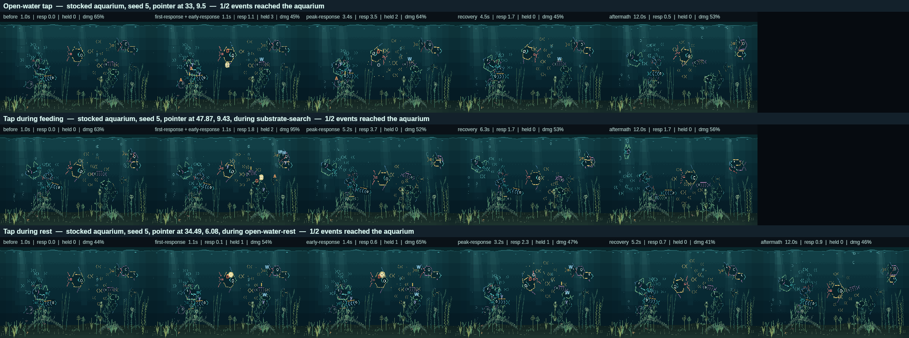

# Phase 2 — Attention, response roles and the contextual tap

**Branch:** `claude/phase-0-completion-2srbne`  ·  **Baseline commit:** `a168a87`  ·  **Date:** `2026-09-09`

This is the phase Stage 2 was written for. Until now a tap did one thing:
fifteen fish dropped what they were doing, in the same tick, and swam at the
point. The pre-Stage-2 instrument measured it as **one activity, whole cast,
every seed**, and everything since has been building the machinery to end it
without losing the guarantee that the aquarium always answers.

A press is now an **attention event**. It still rings the water immediately, and
something always goes to look — but each fish is given a deterministic
**response role**, and most of those roles do not interrupt the fish at all. One
goes to look. One or two come partway and hang back. One finishes its mouthful
and then goes. The rest turn toward it and slow, or lean away, or give one flick
and carry on with their evening.

Measured by the instrument written before Stage 2 began, on the three baseline
seeds: **one tap used to leave 1 activity standing. It now leaves 8, 7 and 7.**

## Changes made

**Production:**

- `src/sim/attention.js` — new. The role vocabulary, the deterministic interest
  score, the assignment (with its caps and its guarantee), the per-fish response
  record and its lifecycle, and the passive-response shaping.
- `src/sim/interaction-context.js` — new. What a press landed on: `fish`,
  `bubble`, `substrate`, `surface`, `plant` or `open-water`.
- `src/sim/interaction-events.js` — a stimulus carries its `context`, and a
  tap's perception radius is 30 cells rather than the whole aquarium.
- `src/sim/state.js` — `applyTouch` classifies the press, registers the events,
  assigns roles, and turns only the fish that are actually going anywhere. The
  school is now drawn to a disturbance near it and ignores one across the tank.
- `src/sim/fish-activities.js` — the activity tick reads roles instead of
  forcing `touch-react` on everything, holds a wider standoff for secondary
  responders, shapes passive responses into the motion a fish was already
  making, and implements the recovery policy. Adds the activity-commitment
  table.
- `src/sim/tick.js`, `src/sim/entities.js` — the per-fish response record is
  carried and cleared; the school's attraction falls off with distance.
- `src/sim/config.js` — `TOUCH_FLOOR_ROWS`, the lowest row a press can reach,
  now named once instead of three times.
- `src/dev/behavior-showcase.js` — the touch-react lab poses a response role as
  well as a disturbance.

**Tooling:** the harness records each fish's role and the per-press role mix;
`npm run capture:interaction -- --roles` draws the roles over the frame.

**Tests:** `tests/attention-roles.test.js` (ten), plus updates where existing
tests asserted the old global behaviour.

## Architecture

**The role vocabulary** — six, fixed, and each one a visible thing:

| Role | What the fish does | What you see |
| --- | --- | --- |
| `investigate` | switches to `touch-react`, closes to its own glass-affinity standoff | goes to look |
| `approach` | same, plus 2.7 cells of extra standoff | comes partway, hangs back |
| `delayed` | keeps its activity for a seeded 0.6–1.6 s beat, then goes | finishes its mouthful, then turns |
| `watch` | keeps its activity; heading bends up to 0.85 rad toward the press, speed −50 % | turns to look |
| `wary` | keeps its activity; heading bends away, speed −30 % | leans away, keeps its distance |
| `acknowledge` | keeps its activity; a 0.8 s flick toward the press | one glance and carries on |

**Assignment** is one deterministic pass over the fish that can perceive the
stimulus (30 cells). Interest is scored from proximity, glass affinity, the
affinity that matches the press's context, boldness, curiosity, energy, whether
the fish's most trusted companion is already going, whether its body suits the
context (a bottom-feeder and a press in the sand), and a small seeded jitter —
minus how absorbed it is in what it is doing. Roles then fall out of interest,
commitment and three caps: **2 primary, 2 secondary, 1 delayed**. Everything
else is passive. Across the sweep that comes to **1–4 fish interrupted by a
single press, 3.2 on average, out of fifteen** (a scenario that presses five
times reaches six, because responders from earlier presses are still finishing).

Two rules make the whole thing safe to build on:

- **Something always answers.** The most interested fish that perceived the
  press always becomes the primary investigator whatever its score, and if none
  perceived it, the nearest fish does. The water rings in the same frame
  regardless. A press is never ignored.
- **Being busy decides *when*, not *whether*.** An absorbed fish never sets off
  mid-mouthful: it either finishes and then goes (delayed) or watches from where
  it is. The commitment table lives with the activities, because that is where
  the knowledge is.

**Recovery** is a resumption, not a cancellation. A fish that turns to look
carries what it was doing on its response record, and when the response ends it
picks that activity back up — and only then, if the activity has naturally
completed, does it choose a new one. Response length is seeded per fish and per
event (0.55–1.45 × the stimulus's own life), so responders let go on different
frames instead of the whole cast snapping back together.

**Bounded state.** One response record per fish — eight scalars plus, for a fish
that put something down, the activity it put down — so fifteen is the hard
maximum. Transient: never serialised, replaced by the next press, cleared by an
offline gap, and gone the moment it expires. `tests/stage-2-invariants.test.js`
now checks per-fish transient keys as well as top-level ones.

## Visual result

A tap no longer looks like a summons. One fish comes over and noses around the
spot; another follows it partway and stops short; the fish that was working the
sand keeps working it, then lifts and goes; a shy one two body-lengths away
leans back and carries on; the ones across the tank tip a nose and keep
swimming. Ten seconds later the aquarium is doing what it was doing before, but
not by snapping back — each fish lets go on its own beat and picks up its own
thread.

The overlay is the developer capture (`--roles`), never the product: **I**
investigate, **A** approach, **D** delayed, **W** watch, **y** wary, **·**
acknowledge, with the ring marking the press. Read the three rows against the
[Phase 0 sheet](../assets/stage-2/phase-0/interaction-baseline-contact-sheet.png),
where every fish in every row is converging on one point.

## Evidence

| Claim | How it was checked | Where |
| --- | --- | --- |
| One tap no longer synchronises the cast | The pre-Stage-2 instrument, unchanged since before Stage 2: activities left standing one frame after a tap went from **1, 1, 1** to **8, 7, 7** on seeds 5, 147, 1234 | `npm run measure:stage2-baseline` |
| …across every scenario and seed | 45 observations: distinct activities after the press **1 → 7.7 mean (6–10)** for a single press; fish interrupted **15 → 3.2 mean (1–4)** | [`interaction-observation.json`](../assets/stage-2/phase-2/interaction-observation.json) |
| Multiple fish visibly react differently | **5.8 distinct roles per press** (3–7). Across the sweep: 68 investigate, 86 approach, 24 delayed, 80 watch, 90 wary, 221 acknowledge, 109 fish out of range | evidence file, `aquarium.roles` |
| Immediate feedback is still guaranteed | A press at any of five points, including a corner and a point with no fish near it, always produces an impulse, a stimulus and at least one investigator — including in a one-fish aquarium | `tests/attention-roles.test.js` |
| Activities are not indiscriminately cancelled | Every fish not interrupted holds the exact activity and velocity it had; the fish that was feeding when the press landed stays on the sand and resumes | `tests/attention-roles.test.js`, `tests/phase2-activities.test.js`, the feeding scenario |
| Recovery is readable | A responder's activity at the frame it lets go is the activity it put down; responders release on different frames | `tests/attention-roles.test.js` |
| Roles are deterministic and bounded | Same aquarium and press give the same roles; caps hold; the vocabulary is closed and every role in it actually occurs | `tests/attention-roles.test.js` |
| Passive responses have a visible correlate | A passive responder differs from its untouched twin in position, speed or pitch within 1.2 s, without changing activity | `tests/attention-roles.test.js` |
| The tap is classified by what it landed on | Six contexts, deterministic, measured against each fish's drawn silhouette rather than a fixed radius; over a press-by-press grid of the whole tank: open water 43 %, fish 28 %, plant 10 %, surface 7 %, bubble 6 %, substrate 6 % | `tests/attention-roles.test.js`, `src/sim/interaction-context.js` |
| Autonomous behaviour is untouched | The ordinary deterministic ten-minute watch is **identical** to the baseline, activity for activity and peck for peck (694) | `npm run measure:readability` |
| The gate is green | 350 tests (340 before, 10 added), simulation 48 000 ticks / 0 failures, persistence 200 / 0, render 540 frames / 0 differing, feeding 0 stages outside tolerance | `npm run verify`, 3 min 24 s |

What a single press looks like now, from the sweep (seed 5):

| Scenario | Roles | Interrupted | Activities after |
| --- | --- | ---: | ---: |
| open-water tap | 1 investigate, 2 approach, 1 delayed, 1 watch, 2 wary, 8 acknowledge | 4 | 9 |
| substrate tap | 1 investigate, 2 approach, 2 watch, 3 wary, 4 acknowledge, 3 out of range | 3 | 9 |
| tap during feeding | 1 investigate, 1 approach, 1 delayed, 2 watch, 3 wary, 5 acknowledge, 2 out of range | 2 | 10 |
| tap during a chase | 1 investigate, 2 approach, 1 delayed, 2 watch, 1 wary, 1 acknowledge, 7 out of range | 4 | 7 |
| tap during rest | 1 investigate, 1 delayed, 2 watch, 2 wary, 9 acknowledge | 1 | 9 |
| night tap | 1 investigate, 1 delayed, 13 acknowledge | 1 | 9 |

Response latency has become a measurement rather than a floor. It was **0.1 s
for every fish at every distance**; it is now a median of 0.1 s for the fish
that answer at once, 0.2 s at the ninetieth percentile, out to 6.7 s for a
delayed investigator — and 32 of 211 measured fish never deviate from their
untouched twin at all, because a press across the tank is not their business.

A response is measured in three channels against the untouched twin — where the
fish ended up, how fast it was going, and how it was held — because Phase 2's
quietest answers are deliberately cheap. A sheltering fish that lifts its nose
four degrees without leaving its spot has answered, and a measure that only
watched position filed exactly those as unaffected. Under the corrected
instrument **no fish that was given a response role is reported as unaffected**;
under the positional-only one, seven were.

## Performance

| Measure | Phase 1 | This phase |
| --- | --- | --- |
| Mature untouched avg / max damage | 58.3 / 51.8 / 52.1 % per seed | identical — no stimulus, no change |
| Interaction avg damage (stocked + mature) | 52.9 % | 53.2 % |
| Interaction worst frame | 97.9 % | 98.1 % |
| Dirty rectangles per frame | 18.2 | 19.0 |
| Peak scene glyphs | 1 245 | 1 245 |
| Full redraws | 0 | 0 |
| Tap damage, pre-Stage-2 instrument | 55.2 / 52.4 / 56.8 % | 55.4 / 52.9 / 56.0 % |

Half a percentage point of average damage, no new peak, no new glyphs, and the
old instrument reads the touched aquarium as slightly *cheaper* than before —
because three fish crossing the tank paint less than fifteen. The scene cost of
this phase is a rounding error; what it spent was thinking, not pixels.

## Persistence

Unchanged. `PERSISTENCE_VERSION` is still 2, no field added. A stocked ten-year
aquarium with fifty taps serialises to 17 872 bytes against 17 853 before —
nineteen bytes of difference from fish sitting in slightly different places, not
from anything new being written. Response roles are transient: absent from the
payload, cleared by a reload and by an offline gap, and the invariants test now
proves it per fish as well as per aquarium.

## Review findings, and what they changed

Nine defects were raised on the pull request and are fixed here, each with a
test that keeps it fixed:

- **A repeated press cost a responder its way back.** A second press while a
  fish was still investigating saved `touch-react` over the activity it had put
  down, so recovery had nothing to resume and the fish was cancelled into an
  unrelated choice — the exact thing this phase promises not to do. A fish that
  is already answering now carries its original thread through any number of
  later presses (`src/sim/state.js`).
- **A coalesced press handed responders a dead identity.** A near-repeat keeps
  the identity of the event it refreshes, but `registerTouch` was returning the
  freshly minted one, so fish were pointed at a stimulus id the aquarium did not
  hold. It now returns the events as stored (`src/sim/interaction-events.js`).
- **The harness undercounted the quietest responses.** Classification and
  latency used positional divergence alone; speed and posture are now measured
  too (`src/dev/interaction-observation.js`). This changes only how the
  instrument reports, never what the aquarium did — replaying the Phase 1 commit
  with the corrected instrument reproduces that phase's committed strong / weak /
  unaffected counts and its 0.1 s latencies exactly, because under the global
  response every fish was redirected in the first frame. The earlier phases'
  evidence therefore stands as measured.
- **A press on a fish's tail was not a press on the fish.** The context test
  used a fixed 2.6-cell radius, narrower than the drawn body of a seven-column
  adult. It now tests against the sprite the fish is currently grown to at the
  scale its depth draws it (`src/sim/interaction-context.js`), which is what
  moved the context distribution and the headline reading from 9 to 8 activities
  on seed 5.
- **A shy fish did not actually keep its distance.** `wary` turned a fixed half
  radian off the fish's heading, which off a heading that pointed at the press
  still points at the press: **52 of 141 shy responders were still closing on
  the disturbance**, reading as a slightly slower `watch`. The turn is now
  whatever it takes to stop closing, plus the lean — bounded at a quarter turn
  plus half a radian. None are still closing now, except the nine that were
  feeding, whose strike geometry is preserved on purpose
  (`src/sim/attention.js`).
- **A fish arriving for the first time could be pulled off its entry.** The
  guaranteed first responder was chosen before commitment was consulted, so a
  press beside a newcomer swimming in replaced a once-in-a-lifetime choreography
  with `touch-react` — on all three seeds. A fish whose commitment is total is
  now never given an investigating role, guarantee included; the guarantee finds
  another fish, and the newcomer answers by watching (`src/sim/attention.js`).
- **The harness delivered gestures the product cannot receive.** `applyTouch`
  was called for every press, but `src/app.js` answers the primary pointer only.
  The harness now models pointer identity and applies the same filter, so the
  two-place demonstration is one finger pressing twice — which is reachable —
  and a new `two-finger-press` scenario records that the second finger reaches
  nothing (`src/dev/interaction-observation.js`). The Phase 1 report's
  concurrency table was re-measured with the reachable gesture; it reads the
  same.
- **The shy lean decayed through the press.** The first version of the fix above
  scaled the whole turn by the fading response envelope, so a fish whose target
  pointed straight at the disturbance stopped closing for the first quarter of
  its response and then swung back through it, ending pointed straight at the
  press. The first test only sampled 0.1 s in and could not see it. The turn now
  has two parts: enough to stop closing, which holds for as long as the response
  does, and the lean on top, which fades. Sampled through the whole response, on
  six headings and across 27 presses on three seeds - **1 725 samples, none
  closing** (`src/sim/attention.js`).
- **Every fish was measured against the first press.** A history with two
  presses has two causes in it, and the harness attributed distances, time near
  the disturbance and the response curve to whichever press opened the
  observation - so a fish crossing the tank to answer the second one read as a
  fish wandering off. Each fish is now measured against the disturbance its own
  response is pointed at, falling back to the last press to land for a fish that
  has no response and for aquarium code that predates roles
  (`src/dev/interaction-observation.js`). The headline "one frame after the
  press" readings still belong to the press that opened the observation, so
  every single-press scenario reads exactly as before.

## Remaining limitations

- **Long-term familiarity is not in the score yet.** Interest reads fixed glass
  affinity, not what this fish has learned about this viewer. Phase 6 adds the
  relationship term; the hook is one line in `attentionInterest`.
- **`watch` and `acknowledge` differ mostly in degree.** Both turn and slow;
  one is stronger and longer. Phase 8's salience work is where a watching fish
  should get a distinct standoff posture.
- **A press near a specific fish only raises that fish's proximity score.** The
  plan allows more (deliberately not making it a draggable UI element); a
  "someone is pointing at *me*" response is still just distance.
- **Passive responses cannot show on a parked fish.** A sheltering fish that is
  already still has only its posture to answer with, and a nose tip is the whole
  reaction. That is honest, but it is thin.
- **The showcase touch-react loop now includes its own recovery**, so its
  readability signature reads 0.67/0.77 speed and 13.2/22.2 pitch against the
  baseline's 0.73/0.78 and 19.4/23.3. The difference is the aftermath, not the
  approach.
- **Hold, drag and swipe still deliver only their opening press.** Phases 3 and
  4.
- **The second finger is ignored.** The panel takes five; the app answers the
  primary pointer. `two-finger-press` records the current answer so a later
  phase that wants two hands has its before.

## Gate decision

| Gate item (plan §8) | Met |
| --- | --- |
| One tap no longer synchronises the full persistent cast | Yes — 1 activity standing became 6–10; 3.2 of 15 fish interrupted on average |
| Immediate feedback remains guaranteed | Yes — the impulse rings in the same frame and at least one fish always investigates, tested at the corners, the sand, the surface and in a one-fish tank |
| Multiple fish visibly react differently | Yes — 5.8 distinct roles per press, six-role vocabulary, all six occurring, with a capture that shows them |
| Current activities are not indiscriminately cancelled | Yes — every uninterrupted fish keeps its activity and heading; committed fish finish first |
| Recovery is readable | Yes — responders resume what they put down, on staggered per-fish beats |
| Interaction remains deterministic | Yes — same aquarium and press give the same roles; 48 000-tick audit clean |
| No obvious hardware-budget regression | Yes — +0.5 pp average damage, no new peak or glyphs, 0 full redraws |
| Response roles consider distance, activity, personality, glass affinity, energy, social relationships, companions, species and salience | Yes — every term is in `attentionInterest`; familiarity waits for Phase 6, as the plan says |
| Contextual tap classification, deterministic and bounded, with no user modes | Yes — six contexts from the aquarium itself |

**PASS — phase complete; proceed.**
