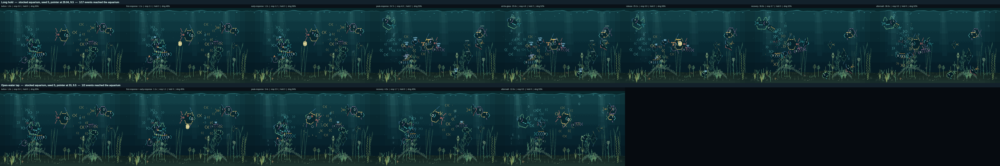

# Phase 3 — Hold interaction and persistent presence

**Branch:** `claude/phase-3-agent-instructions-rpzh2c`  ·  **Baseline commit:** `32b92b7`  ·  **Date:** `2026-09-10`

Until now the aquarium could only be interrupted. A press was an instant: it
rang the water, handed out roles, and was over in 3.2 seconds whatever the
viewer did next — a finger left on the glass for a minute produced exactly the
same three seconds of aquarium as a finger that touched and left. This phase
gives the rest of the gesture meaning. A press that stays where it was put
becomes a **presence**: fish cross the tank to it, arrive, hover at the glass,
hang there for as long as their own patience lasts, give up one at a time while
the finger is still there, and peel away when it goes. A child can now hold a
finger against the glass and have a fish come and stay with it.

Measured across 24 held gestures on three seeds: **all seven stages of the
plan's arc occur, a fish stays engaged for as long as the finger does (59.6 s of
a 60 s hold), and a sixty-second hold costs the aquarium what a fifteen-second
one does** — one stimulus, at most one impulse, 4–5 fish ever pulled off their
activities, and nothing left three seconds after the release.

## Changes made

**Production:**

- `src/sim/interaction-events.js` — the **held stimulus**: a press refreshed in
  place rather than re-registered, carrying a hold clock, a settling presence
  curve, a staleness guard and a released aftermath. Adds `holdStimulus`,
  `releaseStimulus`, `heldStimulus`, `latestTouchStimulus`, `holdPresence` and
  the shared `holdFalloff`. A held stimulus is kept out of coalescing, and
  stimulus ageing now knows not to expire one — and how to let go of one nobody
  is confirming.
- `src/sim/attention.js` — the **hold arc**. Seven derived phases
  (`holdPhase`), per-fish patience from curiosity, glass affinity and boldness
  (`attentionPatience`), habituation spent on the fish's own answer rather than
  on the hold clock (`attentionEngagement`), the engagement bonus, the
  merge that carries an answer across a re-read (`mergeHoldAttention`), a
  departure standoff that peels a responder off the glass, and the switch that
  lets a re-read carry no first-responder guarantee.
- `src/sim/state.js` — **`applyHold`** and **`applyRelease`**. The transition
  from tap to presence, the movement allowance, the re-read beat
  (`HOLD_REVIEW_SECONDS`), and the release.
- `src/sim/fish-activities.js` — the touch-react target is shaped by the hold
  phase: an arriving fish still travels, an arrived one slows to a sixth of that
  speed, lifts its nose to the presence and hovers on a seeded bob. The activity
  tick now hands `ageAttention` the event the fish is answering, which is how a
  responder finds out the finger has gone.
- `src/sim/tick.js` — the school habituates to a held press in under two
  seconds and keeps a twelfth of its interest. A shoal that hung at a finger for
  a minute would be the summons Stage 2 exists to end.
- `src/app.js` — the contact clock. `pointermove` tracks where the finger is,
  the frame loop feeds `applyHold` before each tick, and `pointerup`,
  `pointercancel` and the developer drawer opening all release.

**Tooling:** the observation harness delivers the whole gesture — press, the
contact once per frame, release — through the same seam
(`applyPointerEvent`, `holdContact`); records the arc each fish reached, how
long it was engaged, and per-aquarium hold readings; and adds two moments to the
contact sheet (`at-the-glass`, `release`) because a tap's moments are the wrong
ones for a hold. Seven hold scenarios were added. `npm run observe:interaction`
gained a hold column and a per-fish arc column; `capture:interaction --roles`
draws the phase under the role.

**Tests:** `tests/hold-presence.test.js` (eighteen), plus the contact-release
paths in `tests/app-lifecycle.test.js` and the record-shape and
gesture-seam expectations in `tests/attention-roles.test.js` and
`tests/interaction-observation.test.js`.

## Architecture

**The held stimulus.** One event, refreshed in place. `held` says a finger is
on the glass, `holdSeconds` how long (clamped at `MAX_HOLD_SECONDS = 90`),
`staleSeconds` how long since the gesture last confirmed it, `released` marks
the aftermath. Salience does not decay while held — the finger really is still
there — it settles from 1 to `HOLD_PRESENCE_FLOOR` (0.9) over 1.6 s and stays.
What ends a hold is not the disturbance fading but each fish's patience.

| Constant | Value | What it is |
| --- | --- | --- |
| `HOLD_THRESHOLD_SECONDS` | 0.45 | past this, a press that has not moved is a presence |
| `HOLD_MOVEMENT_CELLS` | 1.6 | how far the finger may wander from **where it landed** |
| `HOLD_REVIEW_SECONDS` | 0.6 | how often a held press is re-read |
| `HOLD_STALE_SECONDS` | 0.5 | without a refresh, the hold lets go of itself |
| `MAX_HOLD_SECONDS` | 90 | the hold clock stops here |
| `RELEASE_SECONDS` | 2 | how long the presence is remembered after the finger |

**The arc**, derived every frame from the record and where the fish is, never
stored:

| Phase | What the fish is doing | What you see |
| --- | --- | --- |
| `notice` | has a record, has not acted on it | a fish that registered something |
| `orient` | answering passively — turned, slowed, or leaning away | it noticed and carried on |
| `approach` | investigating, further out than it means to stop | on its way |
| `inspect` | arrived, speed cut to 0.16–0.26 cells/s, nose to the glass | nosing at the finger |
| `linger` | arrived and still there 2.2 s later | it has decided to stay |
| `settle` | the finger has not gone; this fish is done with it | it drifts back to its evening |
| `depart` | the finger has gone, the answer is still draining | it peels off the glass |

**Patience is the whole model.** `attentionPatience` is
`2.4 + 4.5·curiosity + 5.2·glassAffinity + 2.4·boldness` seconds — 2.4 s to
about 14.5 s across the cast — and interest decays from full to a floor of
`0.15 + 0.45·glassAffinity` over the same span again, then stays flat. The
distinction that makes it work: **patience is spent on the fish's own answer
where it has one, and on the hold clock where it does not.** A fish crossing the
tank has not been staring at a finger, it has been swimming, so running its
patience down on the hold clock would have it give up halfway every time; a fish
that has been ignoring the presence has been ignoring it for exactly as long as
it has been there, and should not suddenly find it fascinating. Held interest
also carries a 1.2× presence bonus, because a finger that stays has to be worth
*more* than the tap it grew out of, not less.

**A re-read carries no guarantee.** The press is always answered — that is
Phase 2's promise and it is untouched. A press that is *still going on* need
not be: `assignAttention` takes `guarantee: false` on a re-read. That is what
lets a long hold reach the plan's last stage, and it is the reason a sixty
second hold is bounded rather than a permanent claim on two fish.

**Bounded state.** One stimulus for the whole gesture, however long. One impulse
when the finger lands and one when it leaves — the water is still in between,
because a finger resting on glass is not a continuous disturbance and making it
one would repaint the same patch for as long as a child cared to lean on it. One
response record per fish, five new scalars on it (`held`, `released`, `settled`,
`holdSeconds`, `nearSeconds`), all clamped. Two independent guards against a
gesture that never ends: `MAX_HOLD_SECONDS` bounds the numbers, and
`HOLD_STALE_SECONDS` releases a hold the gesture stops confirming — which is
what happens when a browser drops a `pointerup`.

## Visual result

A finger put on the glass and left there is answered the way a tap is — the
water rings, a head or two turns — and then the answer keeps going instead of
fading. One or two fish come across the tank, which takes them ten or fifteen
seconds at aquarium speed, slow down as they get close, and hang a body-length
off the glass with their noses tipped up at the contact, rocking gently. A fish
that was working the sand finishes its mouthful, lifts, comes over, and stays
fifteen seconds before going back down to the same patch. The rest of the cast
turns, looks, and straightens up again over the next few seconds — not together;
a shy fish is done with it in three seconds and a curious one is still watching
at twelve. By half a minute the aquarium has mostly gone back to its evening
with one or two fish still at the glass, and it stays that way however much
longer the finger is there.

Lifting it does not switch anything off. The fish still coming arrive at the
place the finger was and nose around it; the ones already there hold for a beat
and then drift back off the glass over a couple of seconds, one at a time,
picking up whatever they had put down.

Two rows, same aquarium, same seed: a 24-second hold above, the same press as a
tap below. The overlay is the developer capture (`--roles`), never the product —
the role letter with the hold phase written under it, and the ring marking the
contact. The tap has five moments and no arc; the hold has eight, and the
`at-the-glass` column is a thing a tap cannot produce.

## Evidence

| Claim | How it was checked | Where |
| --- | --- | --- |
| Hold is behaviourally distinct from tap | The same press with and without a finger left on it: eight seconds later the tap is being answered by **nobody** and the hold by **2–4 fish**, on all three seeds | `tests/hold-presence.test.js` |
| …and the transition needs no mode | A press at 0.40 s is still a tap; at 0.50 s it is a presence — same event, same id, same responders | `tests/hold-presence.test.js` |
| A fish visibly remains engaged with a stationary finger | Across 24 held gestures: **longest engagement 59.6 s of a 60 s hold**; 2–6 fish reach `linger`. Sampled at 30 s, 45 s and 59 s of a minute-long hold, 1–4 fish are still committed on every seed | [`interaction-observation.json`](../assets/stage-2/phase-3/interaction-observation.json), `tests/hold-presence.test.js` |
| …and they are the fish that like the glass | The fish still at the glass at a minute have a mean glass affinity of 0.75–0.87 against a cast mean of 0.47–0.57 | `tests/hold-presence.test.js` |
| A fish does not keep changing its mind at the glass | Active-role changes over a 40 s hold went from 14 / 15 / 19 (worst fish 5 / 5 / 10) to **0 / 0 / 0** | `tests/hold-presence.test.js` |
| All seven stages of the arc occur | **7 distinct phases** on every hold of 8 s or more, on all three seeds; the vocabulary is closed and each phase is reached by a different number of fish | `tests/hold-presence.test.js`, evidence file `hold.phasesReached` |
| Multiple fish respond with different levels of commitment | On one 24 s hold: 2 fish engaged for 23.6 s, 2 more for 10.9 s and 13.3 s, 13 settled without ever going. Engagement times differ by more than 2 s within a single hold | `tests/hold-presence.test.js`, `npm run observe:interaction -- --scenario=long-hold --detail=long-hold` |
| A cautious fish is not a slow bold one | The two fish that outstay the rest are the two with above-median patience, which is derived from traits the fish has had since it was created. On seed 5 the stayers have glass affinity 0.88 and 0.83; the two that give up partway have 0.40 and 0.21 | `tests/hold-presence.test.js` |
| A fish finishes its mouthful, then comes | `feeding-hold`: the fish that chose to work the sand is given `delayed`, converts, and runs `orient>approach>inspect>linger>depart` over 15.4 s before resuming `substrate-search`. The same press as a tap gives it 3.2 s and it never arrives | evidence file, `feeding-hold` |
| Release has a readable aftermath | Responders depart rather than stopping: each ends further from the contact than it was when the finger left, they let go on **different frames**, and the presence is remembered for 2 s so a fish still crossing arrives at the place something was | `tests/hold-presence.test.js` |
| …and a responder gets its evening back | Most responders resume the exact activity they put down | `tests/hold-presence.test.js` |
| A 30–60 second hold creates nothing unbounded | A 60 s hold: peak **1 stimulus**, ≤1 impulse, ≤15 records, ≤5 fish interrupted; hold clock, record age and hover time all clamped; **nothing at all** 10 s after release. The 60 s and 24 s holds produce the same readings — 3–5 peak engaged, 11–13 settled, 3.2–4.6 s aftermath | `tests/hold-presence.test.js`, evidence file `endurance-hold` vs `long-hold` |
| A dropped release cannot strand the aquarium | A hold nobody confirms releases itself after 0.5 s and drains normally | `tests/hold-presence.test.js` |
| Repeated holds are not identical performances | The same 8 s hold at the same point in an aquarium that has moved on produces a different cast and different phases — and the same hold on the same aquarium reproduces exactly | `tests/hold-presence.test.js`, `repeated-hold` |
| A hold does not become a crowd at the glass | At least half the cast is passive throughout, and the aquarium never drops below 4 concurrent activities | `tests/hold-presence.test.js` |
| **The tap is unchanged** | **42 of 48** Phase 2 scenarios reproduce byte for byte on anchor, aquarium and renderer readings. The 6 that differ are the two whose gesture leaves a contact on the glass past the hold threshold (`open-water-hold`, `two-finger-press`), which is the phase working | `npm run observe:interaction -- --compare=docs/assets/stage-2/phase-2/interaction-observation.json` |
| …including its synchronisation and cost | The pre-Stage-2 instrument reads **8, 7, 7** activities after a tap and **55.0 / 52.9 / 55.7 %** damage — identical, digit for digit, to the same tool run at the baseline commit `32b92b7` | `npm run measure:stage2-baseline` |
| Autonomous behaviour is untouched | The deterministic ten-minute watch is identical activity for activity and peck for peck (694); every per-activity motion signature, `touch-react` included (0.67/0.77 speed, 13.2/22.2 pitch), matches Phase 2 | `npm run measure:readability` |
| The gate is green | 382 tests (364 before, 18 added), simulation 48 000 ticks / 0 failures, persistence 200 / 0, render 540 frames / 0 differing, feeding 0 stages outside tolerance | `npm run verify` |

What a hold looks like on seed 5, from the sweep (`e` engaged at release,
`l` lingered, `s` settled):

| Scenario | Held | Hold readings | Roles | Damage |
| --- | ---: | --- | --- | ---: |
| open-water-hold | 1.6 s | e4 l0 s0 | 1 inv, 2 app, 1 wat, 4 war, 7 ack | 55.6 / 96.9 % |
| long-hold | 24 s | e2 l2 s13 | 1 inv, 2 app, 1 wat, 4 war, 7 ack | 55.9 / 97.9 % |
| endurance-hold (mature) | 60 s | e2 l4 s13 | 1 inv, 2 app, 1 del, 1 wat, 2 war, 8 ack | 54.4 / 98.1 % |
| substrate-hold | 16 s | e2 l2 s6 | 1 inv, 2 app, 2 wat, 3 war, 5 ack, 2 out of range | 52.7 / 98.1 % |
| feeding-hold | 16 s | e4 l4 s6 | 1 inv, 1 app, 1 del, 2 wat, 3 war, 6 ack | 58.0 / 98.1 % |
| repeated-hold | 8 s ×2 | e4 l3 s1 | 1 inv, 2 wat, 2 war, 10 ack | 52.1 / 98.1 % |
| hold-then-wander | 4.3 s | e4 l1 s0 | 1 inv, 2 app, 2 wat, 3 war, 4 ack | 55.6 / 97.1 % |

`hold-then-wander` is the honest half: a press held for four seconds and then
drawn away ends its hold 0.3 s into the drag, because the finger left the
movement allowance. The aquarium stops claiming the finger is resting there
rather than following it — a gesture with a direction in it is Phase 4's.

## Performance

Compared over the **same 38-second window on the same three settled aquariums**,
which is the only fair comparison: a hold has to be watched for longer than a
tap, and a longer window has more of everything in it.

| Measure | Untouched | Tap | 24-second hold |
| --- | --- | --- | --- |
| Average damage (seeds 5 / 147 / 1234) | 57.0 / 50.8 / 53.4 % | 54.5 / 52.0 / 50.8 % | 57.0 / 52.6 / 51.8 % |
| Mean of those | 53.8 % | 52.4 % | 53.8 % |
| Worst frame | 98.1 / 97.9 / 95.4 % | 98.1 / 77.7 / 97.3 % | 97.9 / 98.1 / 95.4 % |
| Dirty rectangles per frame | 15.7 / 18.5 / 16.9 | 18.3 / 16.3 / 18.6 | 15.6 / 16.5 / 16.7 |
| Peak scene glyphs | 1 195 / 1 102 / 1 129 | 1 195 / 1 102 / 1 131 | 1 198 / 1 102 / 1 152 |
| Full redraws | 0 | 0 | 0 |

A 24-second hold costs **1.4 percentage points of average damage over a tap**
and lands on the untouched aquarium's own average to a tenth of a point: over
half a minute, an aquarium with a finger on it repaints what an aquarium
nobody is touching repaints. It uses fewer dirty rectangles than either, and it
adds at most 23 glyphs at peak (the release ripple, plus fish standing where
they would not have been). No full redraws. The one worst frame above the
untouched aquarium's — seed 147, 98.1 % against 97.9 % — is a near-full repaint
that both runs produce: the untouched one at 15.0 s and the held one at 18.1 s.
It is the same frame arriving at a different moment because the aquarium is in a
different place, not an extra one the hold created.

Against the Phase 2 sweep, whose scenarios are all taps: those 42 scenarios read
identically, so the phase's renderer cost is entirely in the gestures it added.
The mature `endurance-hold` — a full minute of contact in a ten-year tank —
averages 54.4 % against the [baseline's](baseline-2026-09-09.md) untouched
mature figure, with 0 full redraws.

## Persistence

Unchanged. `PERSISTENCE_VERSION` is still 2 and no field was added. The hold is
transient in every sense the invariants test checks: absent from the payload,
absent per fish, cleared by a reload and cleared by an offline gap.

A ten-year aquarium with 200 taps serialises to **17 975 bytes**. Adding five
consecutive sixty-second holds takes it to **21 153 bytes** — and the same
aquarium left completely alone for the same five and a half minutes reaches
**21 110**. The 43-byte difference is fish sitting in slightly different places;
the 3 KB is social memory forming, which happens whether anybody touches the
glass or not. Both are comfortably inside the 24 000-byte ceiling
`tests/stage-2-invariants.test.js` enforces.

## Defects found in review

Seven were raised on the pull request by the automated reviewer. All seven were
real, and each is fixed here with a test that fails without the fix:

- **A fish already at the glass kept changing its mind about how close to get.**
  A re-read that changed an engaged fish's role rebuilt its record, and the
  record's age *is* the patience it has spent — so a ten-second veteran got its
  full appetite back and a fish sitting near a threshold flipped
  `investigate`/`approach` on consecutive 0.6 s reviews, jerking 2.7 cells in
  and out of the glass. Measured over a 40 s hold: **14, 15 and 19 active-role
  changes on the three seeds, one fish flipping ten times.** The age now carries
  across a role change, and a fish already answering keeps the answer it is
  giving as long as it still wants to — with a lower bar for staying than for
  coming, because deciding to cross the tank and deciding to keep hanging where
  you already are are not the same decision. **0, 0 and 0 flips**
  (`src/sim/attention.js`).

  This one deserves its own paragraph, because fixing it exposed that a headline
  claim of this report had been resting on it. With the age reset gone, every
  responder habituated and **the aquarium had nobody left at the finger by 30
  seconds** — the "a fish stays engaged for as long as the finger does" evidence
  had been riding on the bug refilling their interest. The two-bar rule above is
  what produces it legitimately: 2–6 fish are still at the glass at 59 s, and
  they are the fish that like the glass (mean glass affinity 0.75–0.87 against a
  cast mean of 0.47–0.57), which is the personality claim the plan actually
  asks for.
- **A `pointerup` the page never received could pin a fish to the glass
  forever.** The simulation's staleness guard cannot help while the app is still
  confirming the contact every frame, so the guard only ever protected callers
  that stopped calling — which the test exercised and the product did not. Ending
  a contact is the platform's job, and it is now over-covered: the release, a
  cancelled contact, the pointer capture being lost, a release that landed
  anywhere else on the page, the drawer opening, the tab going away — and, needing
  no event at all, the frame loop once the contact passes `MAX_HOLD_SECONDS`
  (`src/app.js`).
- **A second finger's cancellation released the primary hold.** The
  `pointercancel` handler took no pointer id, so a stray touch on the five-point
  panel ended a gesture it is not supposed to be able to reach. It now checks
  which finger it was (`src/app.js`).
- **A finger drawn through the clamped bands read as standing still.** The
  movement allowance was measured on the point the aquarium *acts* on, which is
  clamped into the band a fish can be sent to — so a press dragged from row 19 to
  row 16 travelled three cells and moved that point not at all, and a drag along
  the sand was promoted to a stationary hold. A stimulus now carries where the
  viewer actually pressed as well as where the aquarium can act, and the
  allowance is measured on the first (`src/sim/interaction-events.js`,
  `src/sim/state.js`).
- **Letting go of the sand raised a second full burst.** The release impulse is
  deliberately the gentler of the two, but the substrate bubble source read
  every substrate impulse as the same event and emitted its 3–6 bubbles
  regardless of strength — so a "gentle" release puffed as much silt as the
  press had, which reads as another press. Bubble count now honours the impulse
  strength it is given: a press raises what it always did (strength is 1, so the
  tap is unchanged), a release raises about half (`src/sim/bubbles.js`).
- **A hold could attach itself to the wrong press after the sequence
  wraparound.** Sequence numbers wrap on purpose — they must not grow over
  months of touching — so on the wrap the newest press carries the smallest
  number, and picking the largest handed the gesture an unrelated live event to
  measure its movement allowance against. The lookup now asks for the press that
  *is* the aquarium's current sequence (`src/sim/interaction-events.js`).
- **A replayed release over the developer corner was swallowed.** The harness
  rejected every event mapped into the hotspot, so a contact that started in the
  aquarium and lifted over the corner never delivered its release, and the
  replay confirmed a finger that was no longer down for the rest of the run.
  `src/app.js` ends the contact before it looks at hotspot tap semantics at all;
  the corner now rejects presses only (`src/dev/interaction-observation.js`).

## Defects found while building

Two were found by re-reading the diff against what the aquarium actually did,
before the pull request existed, and each has a test that keeps it fixed:

- **Letting go twitched the whole cast.** A passive answer is renewed for as
  long as the finger is there, so at release every one of the eleven-to-thirteen
  fish that had long since straightened up had its record flipped to "draining"
  with a *full* envelope — a fresh, full-strength turn toward a disturbance that
  had just stopped existing, in one frame, across the tank. It is exactly the
  synchronised cast Stage 2 exists to end, and it was invisible in the summary
  numbers because the fish did not change activity. A passive answer now resumes
  draining from wherever its habituation had got to, so a fish whose patience
  was spent simply lets the record go: measured against the same aquarium with
  the finger left in place, settled watchers now turn under a degree at release
  while the fish still at the glass turn ten (`src/sim/attention.js`). It also
  corrected the measured aftermath from 3.9–4.2 s to 2.3–2.9 s, which had been
  counting the twitch.
- **The engagement bonus leaked into taps.** Repeated taps at one point coalesce
  into a single stimulus, so a fish already answering that stimulus was
  collecting the hold's "already engaged" bonus from a *tap* — quietly changing
  how the aquarium answers a drumming finger, which is Phase 2 behaviour this
  phase has no business touching. It showed up as three `repeated-taps`
  scenarios diverging from the Phase 2 evidence. Engagement is now defined only
  against a held stimulus, and the comparison went from 39 to 42 identical
  scenarios (`src/sim/attention.js`).

And two found while building, worth recording because the measurements would
have been wrong rather than merely different:

- **The movement allowance was measured against a moving anchor.** The held
  stimulus originally followed the finger, so "how far has it wandered" was
  measured from where the finger was a frame ago — which every finger is always
  nearly at. A drag across the whole tank never exceeded 1.6 cells and the hold
  never ended. A presence now stays where the press landed
  (`src/sim/interaction-events.js`, `src/sim/state.js`).
- **A tap reported an aftermath it did not have.** The harness treated any
  primary release as the end of a presence, so every tap claimed 3.9 s of
  aftermath and a count of fish "engaged at release". The end of a presence is
  now detected from the aquarium — which also covers a hold that ends by
  wandering out of itself rather than by a finger lifting
  (`src/dev/interaction-observation.js`).

## Remaining limitations

- **A hold cannot follow the finger.** A contact that moves more than 1.6 cells
  from where it landed ends the hold rather than dragging the presence with it.
  That is Phase 4, deliberately: a presence that slid around would be the
  beginning of puppet control, and the plan is explicit that pointer motion gets
  its own phase and its own water impulse.
- **`inspect` and `linger` differ only in dwell and half a cell of standoff.**
  A fish that has decided to stay should be visibly *settled* — a different
  hover, a different posture — not the same hover held for longer. Phase 8's
  salience work is where that belongs.
- **The arrival is slow because the aquarium is slow.** A fish 17 cells away
  takes about 20 seconds to reach the glass at ordinary swimming speed, so short
  holds only ever show `orient` and `approach` from the far cast. That is honest
  — fish are not fast — but it means the phase's best behaviour needs a viewer
  patient enough to hold for ten seconds.
- **Habituation has no memory across gestures.** A fish that has just given up
  on a finger starts its patience over if you lift and press again. Phase 9 owns
  repetition and attention saturation across a session; Phase 6 owns whether the
  fish remembers *you* between them.
- **The second finger is still ignored**, so there is no such thing as two
  presences. `two-finger-press` records the current answer.
- **The tap and release animation is a placeholder.** The expanding glyph ring
  is a stand-in for artwork, as [`AGENTS.md`](../../AGENTS.md) now says
  explicitly. Nothing in this phase depends on how it looks; the release impulse
  is a strength, a radius and an envelope, and a replacement should read those.

## Gate decision

| Gate item (plan §9) | Met |
| --- | --- |
| Hold is behaviourally distinct from tap | Yes — eight seconds after the same press, a tap is being answered by nobody and a hold by 2–4 fish, on three seeds |
| A fish can visibly remain engaged with a stationary finger | Yes — 59.6 s of a 60 s hold; 1–4 fish still committed at 30 s, 45 s and 59 s, and 2–6 reach `linger` |
| Multiple fish respond with different levels of commitment | Yes — within one hold, engagement times of 23.6 s, 13.3 s, 10.9 s and 0 s, and the ones that stay are the ones with above-median patience |
| Release has readable aftermath | Yes — the presence outlives the finger by 2 s, responders depart on staggered per-fish beats, each ending further from the contact, and most resume what they put down |
| Long holds remain bounded in state and rendering cost | Yes — one stimulus, ≤1 impulse, ≤15 records, ≤5 fish interrupted, 0 full redraws, +1.2 pp damage over a tap |
| A 30–60 second hold cannot create unbounded effects | Yes — the 60 s and 24 s holds produce the same readings; every accumulating number is clamped; nothing survives 10 s past release; and a hold the gesture stops confirming releases itself |
| The press still begins with the normal tap acknowledgment | Yes — `applyTouch` is untouched and 42 of 48 Phase 2 scenarios reproduce exactly |
| No mode switch is required | Yes — the transition is 0.45 s of not moving, decided in `applyHold`; there is nothing to select and nothing new on screen |
| Personality shapes latency, standoff, approach speed, willingness to remain, late arrival and following a companion | Yes — patience, standoff and the delayed beat come off different traits; the companion bonus is re-evaluated on every re-read, which is what makes late arrival possible at all |
| Repeated holds are not identical performances | Yes — different cast, different phases, from changed state alone; the same hold on the same aquarium still reproduces exactly |
| Interaction remains deterministic | Yes — no clock or random number in `src/sim`; the re-read beat is counted off the hold clock so a replayed hold re-reads on the same seconds; 48 000-tick audit clean |

**PASS — phase complete; proceed.**
