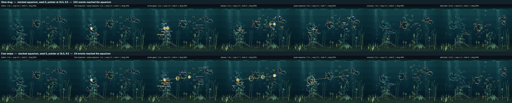
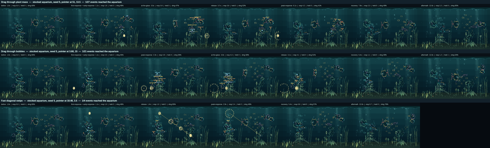

# Phase 4 — Drag, swipe and local water impulse

**Branch:** `claude/phase-4-completion-bli3mm`  ·  **Baseline commit:** `58b1056`  ·  **Date:** `2026-09-10`

Until now a finger that moved was a finger the aquarium had given up on. A press
was a place; a press that travelled more than a fingertip's width stopped being
a presence and the water went still, because motion had no meaning to give it.
This phase gives the rest of the gesture meaning. A finger drawn slowly across
the glass is **a point of interest that is going somewhere** — fish cut the
corner in front of it, follow the water it went through, or pick a piece of its
trail and investigate that while it moves on without them. A finger thrown
across the glass is **water being pushed** — stems lean downstream, bubbles are
carried sideways, the shoal is swept along, and the timid half of the cast leans
out of the way while the bold half comes to see what that was.

Measured across 27 gestures on three seeds: **a drag is chased by six or seven
fish and a swipe by two to four, a swipe leaves twice as many fish leaning away
as a drag does, the environment moves downstream rather than outward by four to
one, and none of it grows** — six path samples and three live wakes whether the
gesture lasts a third of a second or a minute, no full redraws, and 81 bytes of
difference in a ten-year save after five minutes of continuous dragging.

## Changes made

**Production:**

- `src/sim/pointer-path.js` — **new.** The bounded gesture memory: at most
  `PATH_SAMPLES` samples, spaced by time rather than by frame, with the newest
  kept live. `pathMotion` reads position, direction, speed and curvature off it;
  `pathPointBefore` answers "where was the finger a third of a second ago";
  `classifyGesture` puts a speed into the drag or swipe band with hysteresis.
  Speeds are measured in column-widths with rows counted double, because a cell
  is twice as tall as it is wide and a classifier that could not tell them apart
  would call a slow vertical drag a swipe.
- `src/sim/interaction-events.js` — the **moving stimulus** and the **wake**.
  `refreshContact` (which replaces `holdStimulus`) now takes an optional motion:
  a still contact keeps the position it landed on, a moving one takes the new
  point, the path and the three numbers read off it. Impulses gained a direction
  (`dirX`/`dirY`); `registerWake` rings the water behind a moving finger on a
  rotating ring of `MAX_WAKE_IMPULSES` identities, `wakeIsDue` and `wakeSpacing`
  ration it by distance, and `impulseFlowAt` is the one function that says which
  way the water is going at a point.
- `src/sim/state.js` — **`applyContact`** replaces `applyHold`. One verb for a
  contact that is still down, which reads what the gesture currently is from the
  contact itself: still, drag or swipe. The Phase 3 branch is unchanged down to
  the stimulus keeping its anchor; the moving branch moves the event, emits the
  wake and re-reads the response on the same beat — and off the beat the moment
  the gesture *changes*, because a swipe answered half a second later is not
  answered.
- `src/sim/attention.js` — **pursuit** and **startle**. `stimulusFocus` returns
  the place a fish is actually swimming to, which for a moving contact is one of
  three: ahead of the finger (`intercept`), the water it went through
  (`trail`), or the oldest place the path remembers (`mark`). `attentionPursuit`
  derives which from boldness and from how sharply the finger is turning — a
  curling drag is followed rather than headed off, because interception only
  works on a line. A swipe subtracts interest in proportion to how timid a fish
  is and widens the circle of turned heads, so fast water scatters rather than
  attracts. `holdPhase` and the hover clock now measure against the fish's focus
  rather than the fingertip.
- `src/sim/fish-activities.js` — the `touch-react` target resolves through
  `attentionFocus`, clamped into the water a fish may be sent to.
- `src/sim/plants.js` — a stem in *moving* water leans downstream rather than
  away. One sign on one term: an undirected press still pushes the stems either
  side of it apart, and a vertical sweep barely bends them at all, because a
  plant takes the horizontal share of the flow.
- `src/sim/bubbles.js` — bubbles are deflected by moving water, applied once for
  every kind of bubble because they all float in the same water.
- `src/sim/tick.js` — the school is carried by `impulseFlowAt`. This is not
  attention: it applies to a fish facing the other way with its eyes shut.
- `src/render/render.js` — a directed impulse's ring is drawn out along the
  direction and drifts with it, so a swipe does not read as a row of taps. This
  is the same placeholder `AGENTS.md` describes.
- `src/app.js` — calls `applyContact`.

**Tooling:** the observation harness records what the aquarium made of the
motion — which gesture it received and for how many frames, peak speed and
curvature, the largest the path ever got against its cap, wakes created and
wakes live at once, which role each fish played *while the contact was moving*
and how it chased, how far behind the finger the nearest fish was, the longest
unbroken time any fish spent inside a body length of it, and how many stems and
bubbles went downstream against upstream. Seven scenarios were added (the plan's
required captures, minus the two that already existed).
`npm run observe:interaction` gained a gesture column and a pursuit column;
`capture:interaction --roles` draws the bounded path, the wake's direction and
each chasing fish's pursuit.

**Tests:** `tests/drag-swipe.test.js` (twenty-eight, eleven of them the two
review rounds below). Four Phase 3 tests changed what
they assert — see [Defects and changed expectations](#what-phase-3-asserted-that-is-no-longer-true).

## Architecture

**One contact, three meanings, no modes.** A press is a tap until it has stayed
put past `HOLD_THRESHOLD_SECONDS`. A press that stays inside
`HOLD_MOVEMENT_CELLS` of where it landed is Phase 3's presence, unchanged. A
press that leaves that allowance is a gesture with a direction in it, and the
allowance is **latched** — a finger that wanders and comes back to rest is a
drag that stopped, not a presence that started late.

**The path is the cap.** Six samples is the whole record of a gesture, however
long it lasts. Sampling is spaced by time, not by frame, so the window is the
same half second whether the platform confirms a contact ten times a second or
thirty; a caller slower than that keeps two samples rather than describing a
finger by where it was a second and a half ago.

| Constant | Value | What it is |
| --- | --- | --- |
| `PATH_SAMPLES` | 6 | the hard cap on the gesture's memory |
| `PATH_SAMPLE_SECONDS` | 0.09 | the spacing between kept samples |
| `PATH_MEMORY_SECONDS` | 0.54 | how far back the path remembers, whatever the frame rate |
| `SWIPE_ENTER_SPEED` | 34 | column-widths a second to become a swipe |
| `SWIPE_EXIT_SPEED` | 20 | …and to stop being one (the hysteresis) |
| `WAKE_SPACING_CELLS` | 4 | how far the finger travels between wakes, widened with speed |
| `MAX_WAKE_IMPULSES` | 3 | wakes **live at once**; the fourth replaces the first |
| `WAKE_SECONDS` | 0.95 | how long a wake takes to arrive, displace and settle |
| `WAKE_MINIMUM_SPEED` | 2 | under this the finger is drifting, not moving water |
| `WAKE_MINIMUM_STRENGTH` / `WAKE_MAXIMUM_STRENGTH` | 0.24 / 0.9 | a stroke against a shove |
| `PURSUIT_MINIMUM_SPEED` | 4 | under this every pursuit collapses onto the contact |
| `PURSUIT_LEAD_SECONDS` / `PURSUIT_LEAD_CELLS` | 0.45 / 9 | how far ahead an interceptor aims, and its ceiling |
| `PURSUIT_TRAIL_SECONDS` | 0.35 | how far behind a trailing fish follows |
| `INTERCEPT_BOLDNESS` / `TRAIL_BOLDNESS` | 0.62 / 0.34 | where the cast divides between the three |
| `SWIPE_STARTLE` | 0.22 | interest a swipe costs a fish with no boldness at all |
| `SWIPE_WARY_TEMPERAMENT` | 0.68 | the bar for leaning away, against 0.42 for a tap |
| `SWIPE_WATCH_SCALE` | 1.25 | how much wider the circle of turned heads is |
| `SCHOOL_FLOW_RESPONSE` | 2.2 | how hard moving water carries the shoal |
| `BUBBLE_FLOW_CELLS` | 1.6 | the furthest a current can push a bubble sideways |

**Water that is going somewhere.** `impulseFlowAt(state, x, y)` is one function
and everything that floats asks it the same question. An undirected impulse — a
press, the ring a release leaves — contributes nothing to it: that is a shock
outward from a point rather than a current, and the consumers that care about
the difference read the impulse itself. Vertical distance counts double, so the
reach is the circle a viewer sees rather than the ellipse the cell grid gives.

**Nothing here moves a fish.** The three pursuits move the *point a fish has
decided to swim to*; the fish gets there at its own speed, through the same
steering every other activity uses, and arrives or is left behind. The gate item
is measured rather than asserted — see the puppet reading below.

**Bounded state, in full.** One stimulus for the whole gesture. Six path samples
on it, plus four scalars (`gesture`, `speed`, `dirX`/`dirY`, `curvature`). At
most three live wake impulses inside the existing six-impulse cap, so a wake can
never evict the press that started the gesture or the ring that ends it. One
response record per fish, unchanged in size — pursuit is derived every frame,
not stored. Nothing is serialised.

## Visual result

A finger drawn slowly across the tank is followed, but not the way a cursor is
followed. One fish cuts across in front of it and waits where it is going to be;
another falls in a body length behind it and noses at the water it just left; a
third stops at a patch the finger passed several seconds ago and investigates
that instead while the finger goes on without it. Fish arrive after the finger
has gone by. Stems lean over as the water reaches them and straighten behind it,
all leaning the same way, so the bed reads as a current passing rather than as a
row of separate pokes. A rising column of bubbles bends sideways and comes back.

A fast swipe is a different event and it does not look like a fast version of
the first one. The water rings in a drawn-out oval that travels along the path
and settles inside a second, the shoal is visibly swept along it, and the cast
divides: the shy fish put water between themselves and it — a lean, never a
flight — while one or two bold ones turn and come to look at where it went. It
is over in three seconds and nothing is worse for it.

Letting go of either one behaves the way letting go of a hold does: the fish
still on their way arrive at the place something just was and nose around it,
then drift back off and pick up what they had put down.

The same path at two speeds, same aquarium, same seed. The overlay is the
developer capture (`--roles`), never the product — the bounded path in green for
a drag and amber for a swipe, the wake's direction as a short line, and each
fish's role with its pursuit written under it. The drag's path is a short
segment because it is only ever half a second of history; the swipe's covers
most of the tank because half a second is most of the tank.

A drag through the densest planting, a drag through a rising bubble column, and
a diagonal swipe, on the same aquarium.

## Evidence

All readings are from `npm run observe:interaction` over three seeds
(5 / 147 / 1234) unless stated, and are kept in
[`interaction-observation.json`](../assets/stage-2/phase-4/interaction-observation.json).

| Claim | How it was checked | Where |
| --- | --- | --- |
| A slow drag and a fast swipe are different gestures | The same path over 3 s and over 0.3 s: **13.9** against **110.8** column-widths a second, classified `drag` for 28 frames and `swipe` for 2, on all three seeds | `tests/drag-swipe.test.js`, evidence `gesture.kinds` |
| …and they are visibly different in the water | Peak wake strength **0.90 against 0.46**, and a swipe's wake reaches **7.5 cells** where the same path drawn slowly reaches **5.2** | `tests/drag-swipe.test.js` |
| …and in what the cast does about them | A drag is chased by **7 / 7 / 7** fish, a swipe by **4 / 5 / 4** and a diagonal swipe by **2 / 4 / 4**. Fish leaning away while the gesture was happening: **7** across three drags, **14** across three swipes, **16** across three diagonal swipes | evidence `gesture.chasing`, `gesture.roles` |
| The bands do not flip as a hand changes speed | A swipe slowed to mid-band stays a swipe; a drag sped up to the same mid-band speed stays a drag | `tests/drag-swipe.test.js` |
| A pointer history stays bounded | A minute of dragging back and forth across the whole tank: the path peaks at **6 samples against a cap of 6**, one stimulus, ≤6 impulses, ≤3 live wakes, ≤15 records. Every scenario in the sweep peaks at 6 or under | `tests/drag-swipe.test.js`, evidence `gesture.peakPathSamples` |
| …and the window it describes does not depend on the frame rate | The same half second of history at 10 fps and at 30 fps; a caller confirming twice a second keeps two samples rather than a stale one | `tests/drag-swipe.test.js` |
| Repeated gestures cannot run away | Six swipes back and forth through the same water: the sixth costs what the first did in impulses, scene objects and glyphs. The `repeated-swipes` scenario holds ≤2 live wakes across four swipes | `tests/drag-swipe.test.js`, evidence `repeated-swipes` |
| Fish reactions retain autonomy | The longest unbroken time any *one* fish spent within a body length of a moving contact is **0–0.4 s** out of gestures 2–3.5 s long, and the nearest fish averages **1.7–6.1 cells behind** the finger. No fish exceeds the aquarium's own speed ceiling. At least four activities stand throughout | `tests/drag-swipe.test.js`, evidence `gesture.puppetSeconds`, `followLag` |
| …and they chase in more than one way | **26 of the 27 runs** divide the responders across at least two of `intercept` / `trail` / `mark`, and **21** use all three. Every one of the fifteen drags uses at least two; the exception is `diagonal-swipe` on seed 5, where only two fish chased it at all | evidence `gesture.pursuits` |
| …with the difference coming from the gesture as well as the fish | A curled drag (curvature 1.39 rad) is intercepted by fewer fish than a straight one on the same aquarium, because heading off a turning finger does not work | `tests/drag-swipe.test.js`, `curved-drag` |
| The nearby environment responds directionally | Across the sweep, **79 stems leant downstream against 19 upstream**, and **54 bubbles** were carried the way the water was going. Exactly: a rightward wake bends every stem in reach right, a leftward one bends every one left, a vertical one bends none, and an undirected press pushes the two sides apart | `tests/drag-swipe.test.js`, evidence `gesture.plantsDownstream` / `plantsUpstream` / `bubblesCarried` |
| A gesture reads as disturbance → displacement → settling | A swipe moves water for **1.4 s** and none is moving 2.5 s later; three seconds after the finger there are no stimuli, no impulses and no response records at all | `tests/drag-swipe.test.js` |
| A gesture cannot punish | Every fish is still present and inside the glass after a swipe, and a whole gesture counts as **exactly one** remembered touch — not one per wake | `tests/drag-swipe.test.js` |
| A drag that stops is answered like a presence | Fish catch up with a finger that stopped moving and hold at it; the contact reports speed 0 and every pursuit collapses onto the same point | `tests/drag-swipe.test.js` |
| Repaint remains localised | **Zero full redraws** in every scenario on every seed, and in the drag, swipe and untouched runs of the render test. Dirty rectangles per frame are *lower* under a gesture than in the untouched aquarium on two of three seeds | `tests/drag-swipe.test.js`, evidence `render.fullRedraws` |
| **The tap and the hold are unchanged** | **56 of 66** scenarios reproduce field for field against Phase 3's evidence on anchor, pointer, aquarium, renderer and moments. Nine of the ten that differ are the three gestures with motion in them (`slow-drag`, `fast-swipe`, `hold-then-wander`) across three seeds; the tenth is `147:feeding-hold`, whose arc is identical and which now raises two bubbles it did not — see [the review findings](#defects-found-in-review) | `npm run observe:interaction -- --compare=docs/assets/stage-2/phase-3/interaction-observation.json` |
| …including its synchronisation and cost | The pre-Stage-2 instrument reads **8, 7, 7** activities after a tap and **55.0 / 52.9 / 55.7 %** damage — identical, digit for digit, to Phase 3 and to the baseline commit `32b92b7` | `npm run measure:stage2-baseline` |
| Autonomous behaviour is untouched | The deterministic ten-minute watch is identical activity for activity and peck for peck (694); every per-activity motion signature, `touch-react` included (0.67/0.77 speed, 13.2/22.2 pitch), matches Phase 3 | `npm run measure:readability` |
| A presence that starts moving is read from the motion, not from its anchor | The path is written for every contact, moving or not; one frame of swipe-speed movement off a five-second hold reads **9.5 cells/s** where a stale anchor would read about 1, and the contact is a swipe within three frames | `tests/drag-swipe.test.js` |
| Determinism holds | The same gesture replayed on the same aquarium gives the same fish in the same places doing the same things | `tests/drag-swipe.test.js`, `npm run audit:simulation` |
| The gate is green | 416 tests (388 before, 28 added), simulation 48 000 ticks / 0 failures, persistence 200 / 0, render 540 frames / 0 differing, feeding 0 stages outside tolerance | `npm run verify` |

What the nine Phase 4 scenarios read on seed 5 (`w` wakes created / live at
once, `c` fish that chased it, `lag` mean cells behind the finger):

| Scenario | Gesture | Peak speed | Wakes | Chased | Lag | Stems ↓/↑ | Damage |
| --- | --- | ---: | --- | ---: | ---: | --- | ---: |
| slow-drag | drag | 13.9 | 6 / 2 | 7 | 3.4 | 2 / 0 | 57.9 / 94.6 % |
| curved-drag | drag | 15.0 | 8 / 3 | 5 | 4.1 | 3 / 1 | 59.5 / 98.1 % |
| fish-drag | drag | 7.1 | 3 / 2 | 5 | 3.1 | 3 / 0 | 54.6 / 71.8 % |
| plant-drag | drag | 6.3 | 3 / 1 | 5 | 4.4 | 3 / 1 | 54.2 / 70.3 % |
| bubble-drag | drag | 7.5 | 3 / 2 | 4 | 3.3 | 5 / 1 | 54.4 / 74.3 % |
| fast-swipe | swipe | 110.8 | 3 / 3 | 4 | 5.6 | 2 / 0 | 55.4 / 97.1 % |
| diagonal-swipe | swipe | 119.5 | 3 / 3 | 2 | 5.4 | 7 / 3 | 55.6 / 96.9 % |
| repeated-swipes | swipe ×4 | 88.3 | 8 / 2 | 9 | 4.9 | 2 / 0 | 55.4 / 98.1 % |
| chase-swipe | swipe | 79.1 | 2 / 2 | 4 | 2.9 | 0 / 0 | 63.7 / 99.0 % |

`chase-swipe` reads 0 stems either way on this seed because the chase it was
aimed at was in open water, nowhere near a plant. That is the scenario being
honest rather than the mechanism failing; the same swipe on seed 147 bent twelve
stems downstream and two back.

## Performance

Compared over the **same twelve-second window on the same three settled
aquariums**, which is the only fair comparison: every run has the same amount of
ordinary aquarium life in it and differs only by what was done to the glass.

| Measure | Untouched | Tap | Slow drag | Fast swipe |
| --- | --- | --- | --- | --- |
| Average damage (seeds 5 / 147 / 1234) | 56.8 / 51.6 / 47.5 % | 53.9 / 52.9 / 49.5 % | 56.8 / 54.8 / 51.2 % | 57.6 / 55.3 / 51.0 % |
| Mean of those | 52.0 % | 52.1 % | **54.3 %** | **54.7 %** |
| Worst frame | 96.9 / 74.7 / 63.8 % | 96.9 / 69.4 / 72.9 % | 98.1 / 96.5 / 97.1 % | 97.1 / 82.8 / 95.6 % |
| Dirty rectangles per frame | 18.7 / 22.7 / 20.7 | 18.9 / 24.0 / 20.2 | 16.9 / 23.6 / 17.5 | 15.2 / 21.1 / 20.4 |
| Peak scene glyphs | 1 190 / 1 102 / 1 123 | 1 194 / 1 102 / 1 131 | 1 244 / 1 141 / 1 171 | 1 261 / 1 163 / 1 202 |
| Peak scene objects | 256 / 241 / 237 | 256 / 242 / 237 | 256 / 242 / 236 | 256 / 245 / 238 |
| Full redraws | 0 | 0 | 0 | 0 |

A three-second drag costs **2.3 percentage points of average damage over an
aquarium nobody is touching**, and a swipe 2.7. Both use *fewer* dirty
rectangles per frame than the untouched aquarium on two of the three seeds — a
wake is a handful of small objects, and a fish that has been drawn to one place
is a fish that is not somewhere else. The peak glyph count rises by 54 (drag)
and 71 (swipe): a wake ring is seventeen glyphs and at most three are alive at
once, which is the whole of the phase's renderer cost. The worst frames are
higher on seeds 147 and 1234 because a wake can land in the same frame as a
plant-growth repaint the untouched run happens to spread differently; no run of
any kind produced a full redraw.

Against the Phase 3 sweep, the 56 unchanged scenarios read identically, so the
phase's cost is entirely in the gestures it added.

## Persistence

Unchanged. `PERSISTENCE_VERSION` is still 2 and no field was added. The path,
the gesture, the wake and the pursuit are transient in every sense
`tests/stage-2-invariants.test.js` checks: absent from the payload, absent per
fish, cleared by a reload and cleared by an offline gap.

A ten-year aquarium (seed 1234) serialises to **17 747 bytes** the moment it is
materialised. After five minutes of ordinary life with nobody touching it:
**20 889 bytes**. After the same five minutes spent dragging a finger back and
forth across the whole tank without stopping: **20 970 bytes**. The 81-byte
difference is fish sitting in slightly different places.

The ~3 KB gap between the materialised save and the five-minute one is social
memory forming, which happens whether anybody touches the glass or not. It is
the [pre-existing overshoot of the 18 KB contract documented in Phase
3](phase-3-hold-presence.md#a-pre-existing-overshoot-of-the-18-kb-contract),
byte-identical here, and it is still not this phase's to close.

## Defects found in review

Ten were raised on the pull request by the automated reviewer, over two rounds.
All ten were real and all ten are fixed here, each with a test that fails
without the fix.

### First round

- **A gesture that began and ended between two ticks was received as a tap.**
  The frame loop confirms a contact once per tick; `pointermove` only moved the
  contact and `pointerup` released it, so a flick delivered inside a hundred
  milliseconds — which is what a swipe across a seven-inch panel is — reached
  the aquarium as a press and a release with nothing in between. No direction,
  no wake, no swipe, on the one gesture the panel is most likely to be given.
  The final position is now confirmed before the release, from the release
  event's own coordinates, which need not be any a `pointermove` reported
  (`src/app.js`, and the harness's matching `endContact`).
- **A responder remembered where the contact was at the last re-read, not where
  it is.** Nothing reads that point while the contact is live — the fish aim
  through the path — but the moment the finger lifts it is the only thing left,
  so a swipe that was over in a third of a second sent every responder back to
  the first third of it. The remembered point now follows the contact every
  frame; the re-read beat still decides *who* answers. It is also what a
  watching fish tips its nose at, so at the beat's pace a passive answer to a
  drag jerked rather than followed (`src/sim/state.js`).
- **The ring a release leaves was rung where the press landed.** It took its
  physical contact from the stimulus's *context*, which is a property of where
  the gesture began. A drag from the sand into open water therefore raised a
  burst of bubbles out of the gravel under its mid-water endpoint, and a drag
  the other way left the sand it ended on undisturbed. It now comes from the
  release position, through the same test the press impulse uses — which is
  what `src/sim/interaction-context.js` says all along: what the water
  physically touched is the impulse's business, and the two can disagree
  (`src/sim/interaction-events.js`).
- **An interceptor aimed at twice the lead it should, vertically.** `speed` is a
  distance on the glass per second, where a row counts double; `dirX`/`dirY` is
  a unit vector in cells. Multiplied straight together, a finger drawn down the
  tank at five rows a second was predicted four and a half rows ahead when it
  would travel two and a quarter, and a diagonal was skewed toward whichever
  component was vertical. The speed is converted back into cells along the
  direction the finger is going, and the cap stays a distance on the glass
  (`src/sim/attention.js`).
- **The wake ring degenerated to two.** Wakes expire in the order they were rung
  and the ring refills in the order the slots come free, so which slot is empty
  has to be asked rather than counted. Counting them named a slot that was still
  ringing: the newest disturbance was overwritten a fifth of the way through its
  life and the free slot was never used. Fixing it is visible in the evidence —
  a swipe now leaves three wakes where it left two, and the sweep's stems
  answering a direction went from 59 downstream / 17 up to **79 / 19**
  (`src/sim/interaction-events.js`).

The last two changed what the aquarium does enough to move the numbers in this
report, and the tables above are the re-measured ones. One further scenario
moved: `147:feeding-hold` is a press beside a fish working the sand, so it is
classified as a `fish` press but rests *on* the substrate — under the old rule
its release rang open water. It now rings the sand it was resting on and raises
two bubbles. Its hold arc, engagement times and phases are identical; that is
why the comparison against Phase 3 reads 56 of 66 rather than 57.

### Second round

Three of these are defects in the **measurements** rather than in the aquarium,
which matters: two of them were inflating or deflating numbers this report
quotes.

- **The autonomy reading was taken on whichever fish happened to be nearest.**
  A drag that passes one fish and then another would report a single long ride
  that neither of them took, and the run was not cleared on frames with no
  moving contact, so two gestures in one history could be joined into one. It is
  now a run per fish, cleared by any frame with nothing beside the contact. The
  measurement is `extendProximityRuns`, pulled out of the loop so that a claim
  the report makes can be tested on its own rather than through a fixture that
  happens to produce it. The reading it was inflating is the one in the gate
  table: **0.4 s**, not 0.6 (`src/dev/interaction-observation.js`).
- **A gesture with no frame of its own reported a wake from nowhere.** The
  first round's sub-frame fix classifies the contact and rings the water inside
  the release, so by the time the frame-level measurement looks, the stimulus is
  released: the observation reported `wakesCreated: 1` with every gesture field
  at zero. `endContact` now hands back the contact as it was classified, and
  the per-fish role and pursuit are looked up from the event each fish is
  *answering* rather than from the contact still on the glass. This is why the
  peak speeds in the tables above went up — a 0.3 s swipe's fastest sample is
  its last one, and that sample had never been counted
  (`src/dev/interaction-observation.js`).
- **The wake count counted slots, not disturbances.** Slots are reused on
  purpose, so four alternating swipes ringing the same water from the same three
  slots were counted as three. It now counts generations — a slot appearing, or
  the wake in it getting younger, which only happens when it was replaced. The
  `repeated-swipes` scenario went from 4 reported disturbances to **8**
  (`src/dev/interaction-observation.js`).
- **Two live disturbances could give their bubbles the same scene identity.**
  The wake's seed is derived from the aquarium and the place, deliberately, so
  a drag that returns to the sand it started on is rung twice with the same
  seed while the press's own 3.2-second impulse is still live. The bubble ids
  were built from that seed, so both bursts drew objects with the same id, which
  the damage calculator collapses in its maps — leaving one burst's old pixels
  unrepainted. Identity now comes from the impulse, appearance still from the
  seed (`src/sim/bubbles.js`).
- **A diagonal wake drifted at the wrong angle.** The ripple is drawn as a
  circle on the *glass*, so its vertical radius is halved — but halving the
  vertical component of a cell-space direction is a different operation. On the
  axes the two agree; on a diagonal the ripple drifted and stretched at a 1:1
  screen slope where the water and the finger were travelling at 2:1. Measured
  on the drawn scene: the centre of a 45° wake now moves 7.9 px across and 15.5
  px down where it used to move 12.4 and 12.3, and the sideways and downward
  cases are unchanged to the pixel (`src/render/render.js`).

## What Phase 3 asserted that is no longer true

Four tests in `tests/hold-presence.test.js` were guarding the sentence "a
gesture with a direction in it is Phase 4's, and the honest thing to do with it
today is to stop pretending the finger is resting there". It is Phase 4 now, so
the property they guard is the same and the outcome has changed: a contact that
leaves the movement allowance no longer *ends*, it becomes a drag. Each test now
asserts that, and that such a press can never become a still presence:

- **a press that stays put becomes a presence, and one that does not stays a
  tap** — the wandering press keeps its identity and becomes a `drag` at the
  finger instead of being released.
- **a finger drawn through the clamped bands is not a stationary hold** and **a
  finger dragged off the edge of the glass is not a stationary hold** — both
  still prove the movement was noticed despite the clamping; the outcome is a
  drag rather than nothing.
- **a press that wandered before the threshold cannot become a presence** — the
  latch is unchanged. A finger that darts away and comes back and rests is a
  drag reporting speed 0, which is the same thing as a presence to everything
  downstream, and is never re-promoted to `press`.

The `hold-then-wander` scenario is the one whose *observation* changed rather
than its assertion: the drag at the end of it is now a gesture rather than a
lifted finger, which is why it is one of the nine scenarios that differ from
Phase 3's evidence.

## Remaining limitations

- **A swipe at ten frames a second is two or three frames**, so it leaves two
  wakes rather than a continuous streak. The wake is spaced by distance, so a
  faster tick would leave more of them; the ring of three bounds it either way.
  This is the device's frame rate rather than a limit of the mechanism.
- **Individual fish are not physically displaced by moving water.** The school
  is, and it is visible. A persistent fish's speed is clamped to its
  choreography maximum every frame, so a velocity nudge is erased inside one
  tick; the swipe's effect on individuals is therefore expressed through role
  and posture — a lean away, a turned head — rather than through position. Doing
  it any other way means overwriting a fish's velocity from a finger, which the
  plan forbids. If a later phase wants a fish visibly shoved, it belongs in
  choreography as a displacement the fish itself performs.
- **Bubbles get horizontal deflection only.** Increased rise, local wobble and
  popping when directly disturbed are Phase 5 (11.2), along with the
  investigable-bubble dead end that phase names.
- **Drifting tufts, snails and shrimp do not answer moving water yet** — Phase 5
  (11.5, 11.6). The wake already carries everything they would need to read.
- **The substrate and the surface answer a wake only as far as they already
  answered a press**: a drag along the sand rings the substrate and lifts the
  existing burst, because the wake carries a `contact`. Silt, displaced grains
  and a localised surface response are Phase 5 (11.3, 11.4).
- **Plant disturbance still ignores vertical distance** — a high wake bends a
  substrate plant as hard as a low one. That is named in the plan as Phase 5
  (11.1) and is deliberately not touched here.
- **The wake's artwork is the acknowledged placeholder.** It is the same ring
  `AGENTS.md` says not to build a gate on, drawn out along the flow.
- **Still one finger.** Two-finger gestures reach nothing, exactly as before.
- The longest any one fish spent within a body length of a moving contact was
  0.4 s, on the slowest drag in the sweep (7.1 cells a second, drawn past a
  resting fish). That is a fish being brushed past rather than a fish being
  driven, and the test's ceiling is one second; if a later phase makes drags
  slower still, the reading is the one to watch.

## Gate decision

| Acceptance-gate item | Met | Reading |
| --- | --- | --- |
| Slow drag and fast swipe are visually distinct | ✅ | 13.9 vs 110.8 cells/s; wake strength 0.46 vs 0.90; chased by 7 fish vs 2–4; 7 vs 14–16 fish leaning away |
| Fish reactions retain autonomy | ✅ | Longest ride 0.4 s of a 2.6 s gesture, mean lag 1.7–6.1 cells, no fish over the aquarium's own speed ceiling, ≥4 activities standing, three pursuit styles in play |
| Nearby environment responds directionally | ✅ | 79 stems downstream against 19 upstream, 54 bubbles carried, the school swept along; exact per-stem signs proved in test |
| Effects settle cleanly | ✅ | Water still 2.5 s after a swipe; nothing at all — stimuli, impulses, records — three seconds after the finger |
| Pointer histories remain bounded | ✅ | 6 samples against a cap of 6 after a minute of dragging; window fixed at 0.54 s across frame rates |
| Repeated gestures cannot create runaway object counts | ✅ | Six swipes: the sixth equals the first in impulses, objects and glyphs; ≤3 live wakes always |
| Repaint remains localized | ✅ | 0 full redraws everywhere; +2.3–2.7 pp average damage over untouched; fewer dirty rectangles than untouched on two seeds of three |

**PASS — phase complete; proceed.**
